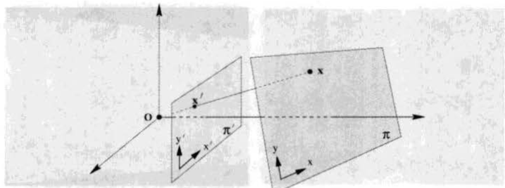
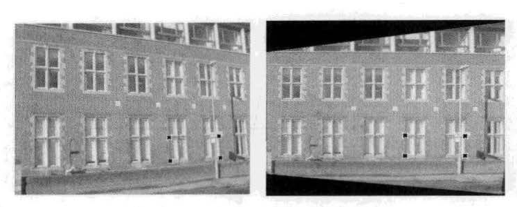
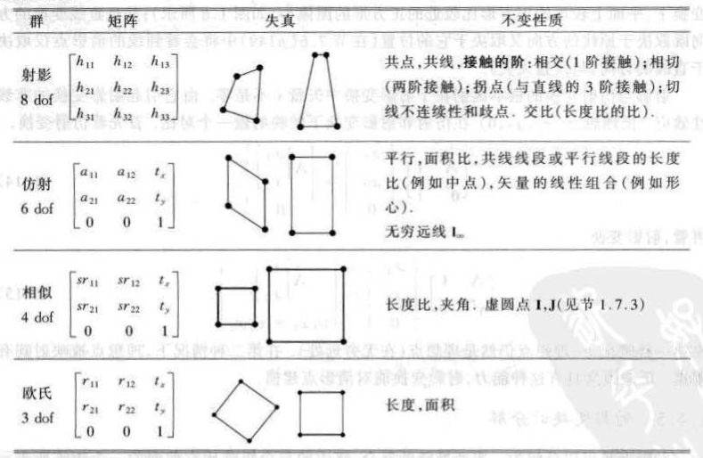

# 1、2D影射几何和变换

[TOC]

## 1.1 平面几何

重要观念：从代数的角度推导几何。

在代数方法中，**几何实体用坐标和代数实体描述**。例如：

- 一个点等同于某坐标基下的一个矢量
- 一条直线也等同于一个矢量
- 一段圆锥线（二次曲线）可以用一个对称矩阵表示

## 1.2 2D影射平面

### 1.2.1 点与直线

##### a.直线的齐次表示：

​	平面上的一条直线可以用形如ax+by+c=0的方程表示，**因此一条直线也可以用矢量(a,b,c)^T表示。**

​	*注意：矢量和直线并非一 一对应（kax+kby+kc=0）*

##### b.点的齐次表示：

​	点 x = (x,y)^T在直线l=(a,b,c)上的充要条件是ax+by+c=0，**用内积形式表示：**
$$
(x,y,1)·(a,b,c)=0\\
等价于：x^Tl=0 \ \ \ (默认列向量)
$$
##### c.直线的交点：

$$
给定两直线 \ l=(a,b,c)^T和 \ l'=(a',b',c')^T \\
定义：x=l×l'(外积，叉乘)\\
叉乘得到的向量与两个向量垂直：l·(l×l')=l'·(l×l')=0\\
推出：l^Tx=l'^Tx=0\\
$$
因此，把x视为一个点，则x既在直线l上，又在直线l’上，那么我们得到定理：

**结论1.1 ：两直线 l 和 l‘ 的交点是点 x = l×l'**

**结论1.2 ： 过两点x和x’的直线是 l = x × x'**

### 1.2.2 理想点与无穷远线

##### 并行线的交点：

​	通过结论1.1可以计算得到，直线(a,b,c)和(a,b,c')的交点为：(b,-a,0)^T , 注意齐次坐标为0，即交于点(b/0 , a/0)^T  ，我们认为是无穷远处。

##### 理想点：

​	齐次矢量x=(x1,x2,x3)^T，当x3=0时，我们认为该点为理想点

##### 无穷远线：

​	无穷远点集合在一条直线上，称为无穷远线
$$
l_{∞}=(0,0,1)^T\\
we \ have : (0,0,1)(x_1,x_2,0)^T=0
$$

##### 射影平面的模型

​	

### 1.2.3 二次曲线与对偶二次曲线

##### 二次曲线的数学表达：

$$
ax^2+bxy+cy^2+dx+ey+f=0\\
x^TCx=0\\
C=
\begin{bmatrix}
a&b/2&d/2\\
b/2&c&e/2\\
d/2&e/2&f
\end{bmatrix}
$$

我们可以用五个点来定义一条二次曲线，**a和c不全为0的时候，等式两边除以a、c中不为0的数，使得方程化为5个未知数。**这样已知5个点，解方程即可得到所有参数。（**只差一个尺度信息**）

##### 二次曲线的切线：

**结论（二次曲线的切线）：过(非退化)二次曲线C上点x的切线l由l=Cx确定**

##### 退化二次曲线：

​	非满秩矩阵C所定义的二次曲线称为退化二次曲线，两条线（r=2），一条重线（r=1）。

## 1.3 射影变换

*Felix Klein：几何研究的是在变换群下保持不变的性质*

##### 射影空间：

$$
在R^3-(0,0,0)^T中的矢量等价类的集合组成\boldsymbol{射影空间P^2}
$$

对任何非零k，矢量(a,b,c)^T与k(a,b,c)^T表示同一直线，我们视这两个只相差一个全局缩放因子的矢量是等价的。

​	**由上述定义，我们可以知道，射影空间P2几何代表R3中所有过(0,0,0)^T的直线的集合。**

​	*射影空间简化了R3线性空间，因为线性空间中有很多等价矢量*

##### 射影映射定义：

​	**定义（射影映射）：**射影映射是P2（射影空间）到它自身的一种满足下列条件的可逆映射h：三点x1,x2,x3共线当且仅当h(x1),h(x2),h(x3)也共线。

​	**射影映射组成一个群**，因为射影映射的逆以及两个射影映射的复合也是射影映射。

​	*射影映射 = 射影变换 = 单应(homography)*

##### 射影变换：

**定理：**
$$
映射h:P^2->P^2是射影映射的充要条件是：存在一个3×3非奇异矩阵H,\\
使得P^2的任何一个用矢量x表示的点都满足h(x)=Hx\\
$$
​	证明：
$$
l^Tx_i=0(i=1,2,3)\\
l^TH^{-1}Hx=0\\
点Hx都在直线H^{-T}l上
$$
**定义(射影变换)：**

​	平面射影变换是关于齐次3维矢量的一种线性变换，并可用一个非奇异3×3矩阵H表示为：
$$
\begin{bmatrix}
x_1'\\x_2'\\x_3'
\end{bmatrix}=
\begin{bmatrix}
h_{11}&h_{12}&h_{13}\\
h_{21}&h_{22}&h_{23}\\
h_{31}&h_{32}&h_{33}
\end{bmatrix}
\begin{bmatrix}
x_1\\x_2\\x_3
\end{bmatrix}\\
即：x'=Hx
$$
H矩阵乘以任意一个非零比例因子不会改变该射影变换，**因此H是一个齐次矩阵。H有8个自由度。**

##### 平面之间的映射

如果在两平面上建立的都是直角坐标系，那么这样一种由中心投影定义的映射有更多约束，**我们称它为透视映射**。

**例：消除平面透视图像的射影失真**

### 1.3.1 直线与二次曲线的变换

##### 直线的变换：

$$
在点变换x_i'=Hx_i下，直线l变换为\\
l'=H^{-T}l
$$

##### 二次曲线的变换：

$$
在点变换x_i'=Hx_i下\\
x^TCx=x'^TH^{-T}CH^{-1}x'\\
C'=H^{-T}CH^{-1}
$$

## 1.4 变换的层次

​	射影变换组成一个群，这个群被称为**射影线性群**，我们将会看到这些特殊情况都是该群的子群。

##### 不变量

​	介绍变换的另一种**代数方法(把变换视为作用于点或曲线的坐标的矩阵)**是用被保持不变的元素或量(不变量)来介绍。**一个几何配置的一个不变量是该配置的函数，其值在某特殊的变换下不变。**例如：两点间的距离在欧式变换(平移旋转)下不变，但在相似变换(平移、旋转均缩放)下则不然。所以，**距离是欧式不变量但不是相似不变量，两线间的夹角既是欧式又是相似不变量。**

### 1.4.1 类I：等距变换

​	等距(isometric)变换是平面R2变换，它保持欧式距离不变。一个等距变换可以表示为：
$$
\begin{bmatrix}
x'\\y'\\1
\end{bmatrix}=
\begin{bmatrix}
cosθ&-sin\theta& t_x\\
sin\theta&cos\theta&t_y\\
0&0&1
\end{bmatrix}
\begin{bmatrix}
x\\y\\1
\end{bmatrix}
$$
另一种形式，旋转矩阵R(R^TR=RR^T=I)
$$
x'=Hx=\begin{bmatrix}
R&t\\0^T&1
\end{bmatrix}x
$$

### 1.4.2 类II：相似变换

相似变换是一个等距变换与一个均匀缩放的复合。
$$
\begin{bmatrix}
x'\\y'\\1
\end{bmatrix}=
\begin{bmatrix}
scosθ&-ssin\theta& t_x\\
ssin\theta&scos\theta&t_y\\
0&0&1
\end{bmatrix}
\begin{bmatrix}
x\\y\\1
\end{bmatrix}\\ \\
x'=Hx=\begin{bmatrix}
sR&t\\0^T&1
\end{bmatrix}x
$$

### 1.4.3 类III：仿射变换

仿射变换是一个非奇异线性变换与一个平移变换的复合：
$$
\begin{bmatrix}
x'\\y'\\1
\end{bmatrix}=
\begin{bmatrix}
a_{11}&a_{12}& t_x\\
a_{21}&a_{22}&t_y\\
0&0&1
\end{bmatrix}
\begin{bmatrix}
x\\y\\1
\end{bmatrix}\\ \\
x'=Hx=\begin{bmatrix}
A&t\\0^T&1
\end{bmatrix}x
$$
矩阵A是一个2×2的非奇异矩阵。平面仿射变换有六自由度，对应于六个矩阵元素。变换可以由三组点对应来计算。

##### 不变量：

1. 平行线
2. 平行线段长度比
3. 面积比	

### 1.4.4 类IV：射影变换

之前已经定义过射影变换，我们取其分块形式
$$
x'=H_px=\begin{bmatrix}
A&t\\v^T&v'
\end{bmatrix}x
$$

### 1.4.5 总结

### 1.4.6 射影变换的分解

射影变换可以分解为一串变换链的复合
$$
H=H_SH_AH_P=
\begin{bmatrix}
sR&t/v\\0^T&1
\end{bmatrix}
\begin{bmatrix}
K&0\\0^T&1
\end{bmatrix}
\begin{bmatrix}
I&0\\v^T&v'
\end{bmatrix}\\
A=sRK+tv^T/v'
$$
其中，detK=1，K为归一化上三角矩阵。

### 1.4.7 不变量的数目

## 1.5 1D射影几何

$$
我们用\bar{x}表示2维矢量(x_1,x_2)^T\\
直线的射影变换由一个2×2的齐次矩阵来表示：\\
\bar{x}'=H_{2×2}\bar{x}
$$

## 1.6 射影平面的拓扑

## 1.7 从图像恢复仿射和度量性质

## 1.8 二次曲线的其他性质

## 1.9 不动点与直线