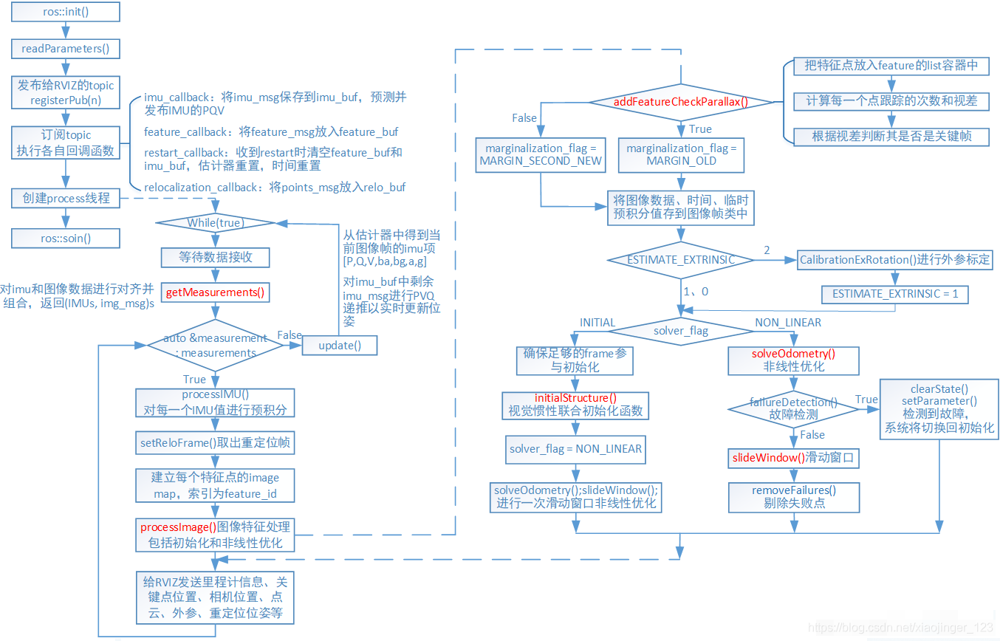
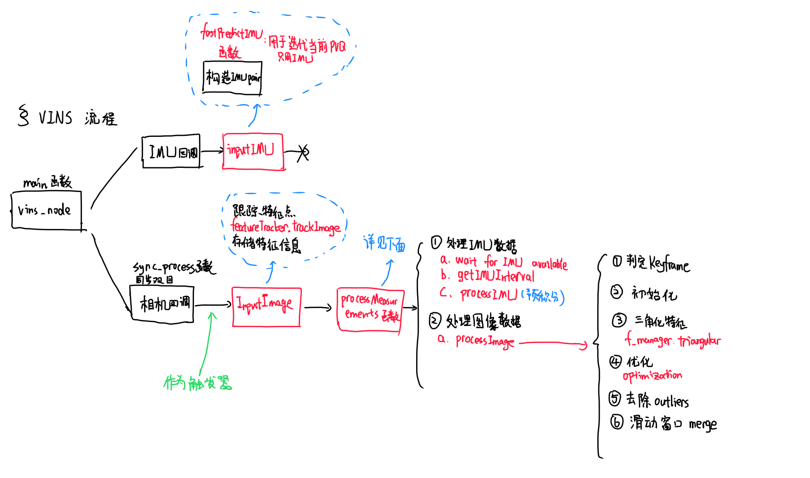
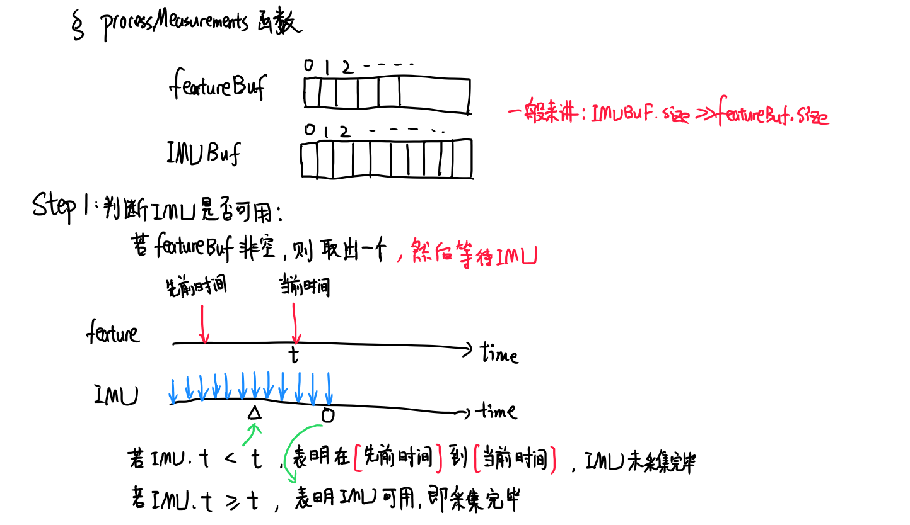
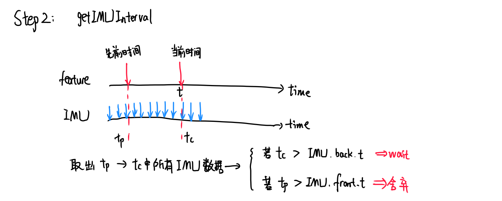

[TOC]


# VINS代码阅读(二)：estimator

https://blog.csdn.net/xiaojinger_123/article/details/119246379

## 一、概述

​	这里主要是状态估计器的代码。







## 二、IMU数据入口 imputIMU函数

​	此函数在主函数`rosNodeTest.cpp`中的IMU回调函数中调用。话题每接收到一个IMU数据，则进入一次此函数。

​	此函数中，根据IMU数据快速预测当前PVQ。并且将加速度和角速度信息压入整体vector(list)。

```c++
void Estimator::inputIMU(double t, const Vector3d &linearAcceleration, const Vector3d &angularVelocity)
{
    mBuf.lock();
    //构造pair，时间和加速度角速度对。压入accBuf和gyrBuf。
    accBuf.push(make_pair(t, linearAcceleration));
    gyrBuf.push(make_pair(t, angularVelocity));
    //printf("input imu with time %f \n", t);
    mBuf.unlock();

    if (solver_flag == NON_LINEAR)
    {
        mPropagate.lock();
        fastPredictIMU(t, linearAcceleration, angularVelocity);
        pubLatestOdometry(latest_P, latest_Q, latest_V, t);
        mPropagate.unlock();
    }
}
```

### 1、fastPredictIMU函数

快速预测函数，简单计算PVQ
$$
dt=t_{now}-t_{last}——时间间隔\\
acc_0=lastQ*(lastacc_0-lastB_a)-g——上时刻加速度\\
gyr=\frac{1}{2}(lastgyr_0-lastB_g+angular-lastB_g)——当前角速度(上时刻和现在均值)\\
lastQ=lastQ*\Delta q——现在旋转姿态\\
acc_1=lastQ(acc_{meas}-lastB_a)-g——当前加速度\\
acc_{now}=\frac{1}{2}(acc_0+acc_1)——取均值\\
P=P_{last}+V_{last}*dt+\frac{1}{2}acc_{now}*dt^2\\
V=V_{last}+acc_{now}*dt\\
再更新测量值即可。当前的变为之前的，之后下一次的变为当前的。
$$
*公式对应代码*

```c++
void Estimator::fastPredictIMU(double t, Eigen::Vector3d linear_acceleration, Eigen::Vector3d angular_velocity)
{
    double dt = t - latest_time;
    latest_time = t;
    Eigen::Vector3d un_acc_0 = latest_Q * (latest_acc_0 - latest_Ba) - g;
    Eigen::Vector3d un_gyr = 0.5 * (latest_gyr_0 + angular_velocity) - latest_Bg;
    latest_Q = latest_Q * Utility::deltaQ(un_gyr * dt);
    Eigen::Vector3d un_acc_1 = latest_Q * (linear_acceleration - latest_Ba) - g;
    Eigen::Vector3d un_acc = 0.5 * (un_acc_0 + un_acc_1);
    latest_P = latest_P + dt * latest_V + 0.5 * dt * dt * un_acc;
    latest_V = latest_V + dt * un_acc;
    latest_acc_0 = linear_acceleration;
    latest_gyr_0 = angular_velocity;
}
```

## 三、图片入口函数 imputImage

​	每当话题接收到图像时，进入此函数。此函数负责跟踪特征点，来获取视觉残差。在函数`trackImage`函数中，对特征点进行跟踪。

​	得到跟踪后的特征点后，进入processMeasurements()函数处理测量信息，计算残差，更新信息矩阵，再进行非线性优化。

```c++
void Estimator::inputImage(double t, const cv::Mat &_img, const cv::Mat &_img1)
{
    inputImageCnt++;
    map<int, vector<pair<int, Eigen::Matrix<double, 7, 1>>>> featureFrame;
    TicToc featureTrackerTime;

    if(_img1.empty())	//单目
        featureFrame = featureTracker.trackImage(t, _img);
    else				//双目
        featureFrame = featureTracker.trackImage(t, _img, _img1);

    if (SHOW_TRACK)
    {
        //展示轨迹
        cv::Mat imgTrack = featureTracker.getTrackImage();
        pubTrackImage(imgTrack, t);
    }
    
    if(MULTIPLE_THREAD)  
    {     
        //多线程
        if(inputImageCnt % 2 == 0)
        {
            mBuf.lock();
            featureBuf.push(make_pair(t, featureFrame));
            mBuf.unlock();
        }
    }
    else
    {
        mBuf.lock();
        featureBuf.push(make_pair(t, featureFrame));
        mBuf.unlock();
        TicToc processTime;
        processMeasurements();
        printf("process time: %f\n", processTime.toc());
    }
    
}
```

## 四、测量处理入口 processMeasurements()

整体流程是：输入图像后，特征提取并且压入featureBuf中。

​	如果featureBuf中有信息，那么拿出其最前面的一个featureBuf，从上次到这次时间段中，把在这个时间段内的所有IMU数据取出。

​	取出对应的图像和IMU数据后，对IMU进行预积分，再处理图像信息(特征点信息)，最后进行滑动窗口优化。




```c++
void Estimator::processMeasurements()
{
    while (1)
    {
        //printf("process measurments\n");
        pair<double, map<int, vector<pair<int, Eigen::Matrix<double, 7, 1> > > > > feature;
        vector<pair<double, Eigen::Vector3d>> accVector, gyrVector;
        if(!featureBuf.empty())
        {
            feature = featureBuf.front();
            curTime = feature.first + td;
            while(1)
            {//等待imu，如果不用imu或者imu已经好了，那么直接break
                //IMUAvailable是来判断imu是不是已经好了的函数
                if ((!USE_IMU  || IMUAvailable(feature.first + td)))
                    break;
                else
                {
                    printf("wait for imu ... \n");
                    if (! MULTIPLE_THREAD)
                        return;
                    std::chrono::milliseconds dura(5);
                    std::this_thread::sleep_for(dura);
                }
            }//end while(1)
            mBuf.lock();
            if(USE_IMU)//获取IMU信息 (t)
                getIMUInterval(prevTime, curTime, accVector, gyrVector);

            featureBuf.pop();//弹出特征信息
            mBuf.unlock();

            if(USE_IMU)
            {
                if(!initFirstPoseFlag)//第一帧imu pose
                    initFirstIMUPose(accVector);
                for(size_t i = 0; i < accVector.size(); i++)
                {
                    double dt;
                    if(i == 0)
                        dt = accVector[i].first - prevTime;
                    else if (i == accVector.size() - 1)
                        dt = curTime - accVector[i - 1].first;
                    else
                        dt = accVector[i].first - accVector[i - 1].first;
                    processIMU(accVector[i].first, dt, accVector[i].second, gyrVector[i].second);//处理IMU数据
                }
            }
            mProcess.lock();
            processImage(feature.second, feature.first);
            prevTime = curTime;

            printStatistics(*this, 0);

            std_msgs::Header header;
            header.frame_id = "world";
            header.stamp = ros::Time(feature.first);

            pubOdometry(*this, header);
            pubKeyPoses(*this, header);
            pubCameraPose(*this, header);
            pubPointCloud(*this, header);
            pubKeyframe(*this);
            pubTF(*this, header);
            mProcess.unlock();
        }

        if (! MULTIPLE_THREAD)
            break;

        std::chrono::milliseconds dura(2);
        std::this_thread::sleep_for(dura);
    }
}
```

### 1、获取IMU信息函数 getIMUInterval()

参数：t0 之前时间；t1 现在时间；accVector要获取的加速度；gyrVector要获取的角速度。




```c++
bool Estimator::getIMUInterval(double t0, double t1, vector<pair<double, Eigen::Vector3d>> &accVector, 
                                vector<pair<double, Eigen::Vector3d>> &gyrVector)
{
    if(accBuf.empty())
    {
        //没有数据
        printf("not receive imu\n");
        return false;
    }
    
	//我们想取得t0~t1时间内所有imu数据
    //如果最新时刻的imu数据的时间还小于t1
    //说明我们等待的时间还不够，需要等待
    if(t1 <= accBuf.back().first)
    {
        //imu最新数据时间已经在t1之后，我们要把t0~t1时间的数据搞出来
        while (accBuf.front().first <= t0)
        {
            //舍弃t0之前的
            accBuf.pop();
            gyrBuf.pop();
        }
        while (accBuf.front().first < t1)
        {
            //保存t0~t1的
            accVector.push_back(accBuf.front());
            accBuf.pop();
            gyrVector.push_back(gyrBuf.front());
            gyrBuf.pop();
        }
        //再压入最后一个
        accVector.push_back(accBuf.front());
        gyrVector.push_back(gyrBuf.front());
    }
    else
    {
        printf("wait for imu\n");
        return false;
    }
    return true;
}
```

### 2、处理每时刻的IMU数据 processIMU

这里预积分函数可以见 `VINS-IMU预积分` 文档。

```c++
void Estimator::processIMU(double t, double dt, const Vector3d &linear_acceleration, const Vector3d &angular_velocity)
{
    if (!first_imu)
    {
        first_imu = true;
        acc_0 = linear_acceleration;
        gyr_0 = angular_velocity;
    }

    if (!pre_integrations[frame_count])
    {
        //当前帧数的预积分值是否为空，若为空则重建一个
        pre_integrations[frame_count] = new IntegrationBase{acc_0, gyr_0, Bas[frame_count], Bgs[frame_count]};
    }
    if (frame_count != 0)
    {
        pre_integrations[frame_count]->push_back(dt, linear_acceleration, angular_velocity);//预积分
        //if(solver_flag != NON_LINEAR)
            tmp_pre_integration->push_back(dt, linear_acceleration, angular_velocity);//预积分

        dt_buf[frame_count].push_back(dt);
        linear_acceleration_buf[frame_count].push_back(linear_acceleration);
        angular_velocity_buf[frame_count].push_back(angular_velocity);

        int j = frame_count;         
        Vector3d un_acc_0 = Rs[j] * (acc_0 - Bas[j]) - g;
        Vector3d un_gyr = 0.5 * (gyr_0 + angular_velocity) - Bgs[j];
        Rs[j] *= Utility::deltaQ(un_gyr * dt).toRotationMatrix();
        Vector3d un_acc_1 = Rs[j] * (linear_acceleration - Bas[j]) - g;
        Vector3d un_acc = 0.5 * (un_acc_0 + un_acc_1);
        Ps[j] += dt * Vs[j] + 0.5 * dt * dt * un_acc;
        Vs[j] += dt * un_acc;
    }
    acc_0 = linear_acceleration;
    gyr_0 = angular_velocity; 
}
```

### 3、处理图像特征

#### i. 概述

```c++
//主要进行状态估计（非线性优化）
//这也符论文中的原理：每到新的图像帧来后，使用非线性优化方法估计机器人当前位姿。
void Estimator::processImage(const map<int, vector<pair<int, Eigen::Matrix<double, 7, 1>>>> &image, const double header)
```

#### ii. 关键帧的判定

相关关键帧判定方式在 **addFeatureCheckParallax函数中**

```c++
ROS_DEBUG("new image coming ------------------------------------------");
ROS_DEBUG("Adding feature points %lu", image.size());
if (f_manager.addFeatureCheckParallax(frame_count, image, td))
{
    marginalization_flag = MARGIN_OLD;
    //printf("keyframe\n");
}
else
{
    marginalization_flag = MARGIN_SECOND_NEW;
    //printf("non-keyframe\n");
}
ROS_DEBUG("%s", marginalization_flag ? "Non-keyframe" : "Keyframe");
ROS_DEBUG("Solving %d", frame_count);
ROS_DEBUG("number of feature: %d", f_manager.getFeatureCount());
Headers[frame_count] = header;

//保存当前图像以及预积分信息
ImageFrame imageframe(image, header);
imageframe.pre_integration = tmp_pre_integration;
all_image_frame.insert(make_pair(header, imageframe));
tmp_pre_integration = new IntegrationBase{acc_0, gyr_0, Bas[frame_count], Bgs[frame_count]};
```

#### iii. 是否优化外参

```c++
if(ESTIMATE_EXTRINSIC == 2)
{
    ROS_INFO("calibrating extrinsic param, rotation movement is needed");
    if (frame_count != 0)
    {
        vector<pair<Vector3d, Vector3d>> corres = f_manager.getCorresponding(frame_count - 1, frame_count);
        Matrix3d calib_ric;
        if (initial_ex_rotation.CalibrationExRotation(corres, pre_integrations[frame_count]->delta_q, calib_ric))
        {
            ROS_WARN("initial extrinsic rotation calib success");
            ROS_WARN_STREAM("initial extrinsic rotation: " << endl << calib_ric);
            ric[0] = calib_ric;
            RIC[0] = calib_ric;
            ESTIMATE_EXTRINSIC = 1;
        }
    }
}
```

#### iv. 初始化+滑动窗口优化

​	VINS中的状态估计器，用视觉特征点跟踪得到的位姿作为后续优化初始值。这里与ORBSLAM不同之处在于，**ORBSLAM利用PnP等手段估计出当前帧初始位姿后，使用local map进一步搜索与当前帧中匹配的点，再进行BA优化，其是就是利用视觉重投影误差优化；而VINS中，误差函数包括视觉重投影误差+IMU预积分误差。**其中，视觉重投影误差，跟踪特征点使用的方法是光流法。

初始化部分这里先不介绍，在之后文档中介绍。这里就看一下有关滑动窗口优化的部分：

```c++
else
{
    TicToc t_solve;//有关优化时间的临时变量
    if(!USE_IMU)
        f_manager.initFramePoseByPnP(frame_count, Ps, Rs, tic, ric);
    f_manager.triangulate(frame_count, Ps, Rs, tic, ric);//三角化
    optimization();//优化
    set<int> removeIndex;
    outliersRejection(removeIndex);//除去outliers投影
    f_manager.removeOutlier(removeIndex);
    if (! MULTIPLE_THREAD)
    {
        featureTracker.removeOutliers(removeIndex);
        predictPtsInNextFrame();
    }

    ROS_DEBUG("solver costs: %fms", t_solve.toc());

    if (failureDetection())
    {
        ROS_WARN("failure detection!");
        failure_occur = 1;
        clearState();
        setParameter();
        ROS_WARN("system reboot!");
        return;
    }

    slideWindow();//滑动窗口merge
    f_manager.removeFailures();
    // prepare output of VINS
    key_poses.clear();
    for (int i = 0; i <= WINDOW_SIZE; i++)
        key_poses.push_back(Ps[i]);

    last_R = Rs[WINDOW_SIZE];
    last_P = Ps[WINDOW_SIZE];
    last_R0 = Rs[0];
    last_P0 = Ps[0];
    updateLatestStates();
}  
```

### 4、滑动窗口优化(重点)(未完成)

参考：https://blog.csdn.net/huanghaihui_123/article/details/87361621

1. para_Pose[i]：滑动窗口内11帧的位姿，6自由度7变量表示 SIZE_POSE: 7
2. para_SpeedBias[i]：滑动窗口11帧对应的速度,ba,bg,9自由度。SIZE_SPEEDBIAS: 9
3. para_Ex_Pose[i]: 相机到IMU的外参变换矩阵，6自由度7变量表示 SIZE_POSE: 7
4. para_Td[0]: 滑窗内第一个时刻的相机到IMU的时钟差

#### i. 创建ceres::problem

```c++
TicToc t_whole, t_prepare;
vector2double();

ceres::Problem problem;
ceres::LossFunction *loss_function;
//loss_function = NULL;
loss_function = new ceres::HuberLoss(1.0);
//loss_function = new ceres::CauchyLoss(1.0 / FOCAL_LENGTH);
//ceres::LossFunction* loss_function = new ceres::HuberLoss(1.0);
```

#### ii. 添加优化变量

参考：https://blog.csdn.net/qq_42700518/article/details/105898222

添加待优化的变量，包括维数、初始值。

```c++
for (int i = 0; i < frame_count + 1; i++)
{
    ceres::LocalParameterization *local_parameterization = new PoseLocalParameterization();
    problem.AddParameterBlock(para_Pose[i], SIZE_POSE, local_parameterization);//SIZE_POSE = 7 平移+四元数
    if(USE_IMU)
        problem.AddParameterBlock(para_SpeedBias[i], SIZE_SPEEDBIAS);//包括速度speed 和 两个bias
}
if(!USE_IMU)
    problem.SetParameterBlockConstant(para_Pose[0]);//如果设定为不用IMU，则锁定优化变量
```

#### iii. 是否优化外参

```c++
for (int i = 0; i < NUM_OF_CAM; i++)
{
    //如果双目就是优化两个相机外参
    //单目就是优化一个相机外参
    ceres::LocalParameterization *local_parameterization = new PoseLocalParameterization();
    problem.AddParameterBlock(para_Ex_Pose[i], SIZE_POSE, local_parameterization);
    if ((ESTIMATE_EXTRINSIC && frame_count == WINDOW_SIZE && Vs[0].norm() > 0.2) || openExEstimation)
    {
        //ROS_INFO("estimate extinsic param");
        openExEstimation = 1;
    }
    else
    {
        //ROS_INFO("fix extinsic param");
        problem.SetParameterBlockConstant(para_Ex_Pose[i]);
    }
}
problem.AddParameterBlock(para_Td[0], 1);//添加时空标定参数

if (!ESTIMATE_TD || Vs[0].norm() < 0.2)
    problem.SetParameterBlockConstant(para_Td[0]);//不优化时间差
```

#### iv. 添加残差项

**1)、边缘化的残差项：**直观上，我们认为，滑窗在滑动的过程中，因为要丢弃一些过去的帧，但是过去帧留有一些有效的信息。因此我们在现在姿态估计的过程中，还是需要考虑之前丢弃的帧的一些约束条件。观察变量由：last_marginalization_info提供。

```c++
if (last_marginalization_info && last_marginalization_info->valid)
{
    // construct new marginlization_factor
    MarginalizationFactor *marginalization_factor = new MarginalizationFactor(last_marginalization_info);
    problem.AddResidualBlock(marginalization_factor, NULL,
                             last_marginalization_parameter_blocks);
}
```

**2)、预积分的残差项：**预积分的计算式可以在`imu_factor.h`中看到，预积分的测量在`VINS-IMU预积分.md`文件中介绍了。这里，误差就是计算值和测量值的差值。

即在
 para_Pose[i]，para_SpeedBias[i]
 para_Pose[j]，para_SpeedBias[j]
 这四个变量是正确的情况下，推算出来的pre_integration真值与实际的测量值之间的偏差。

```c++
if(USE_IMU)
{
    for (int i = 0; i < frame_count; i++)
    {
        int j = i + 1;
        if (pre_integrations[j]->sum_dt > 10.0)
            continue;
        IMUFactor* imu_factor = new IMUFactor(pre_integrations[j]);
        problem.AddResidualBlock(imu_factor, NULL, para_Pose[i], para_SpeedBias[i], para_Pose[j], para_SpeedBias[j]);
    }
}
```

**3)、视觉的残差项：**以三角化的特征点一个个进行添加残差。具体过程，假设第l个特征点（在代码中用feature_index表示），第一次被第i帧图像观察到（代码中用imu_i表示），那个这个特征点在第j帧图像中（代码中用imu_j表示）的残差,即
para_Pose[imu_i]，para_SpeedBias[imu_i]
para_Pose[imu_j]，para_SpeedBias[imu_j]
para_Ex_Pose[0]
para_Td[0]
para_Feature[feature_index]
这些都是真值的情况下，可以解算出：
pts_i pts_j (代表这个l特征点在i,j帧坐标系下的空间位置)
it_per_id.feature_per_frame[0].velocity,
it_per_id.feature_per_frame[0].cur_td, （it_per_id指的是第一次这个特征点被观测到对应的帧）
it_per_frame.velocity,
it_per_frame.cur_td（it_per_frame指的是这个特征点要计算残差的那帧）


**同样地，具体计算误差以及雅可比的方式在`projectionOneFrameTwoCameraFactor`等文件中可以找到。**

```c++
for (auto &it_per_id : f_manager.feature)
{
    it_per_id.used_num = it_per_id.feature_per_frame.size();
    if (it_per_id.used_num < 4)
        continue;

    ++feature_index;

    int imu_i = it_per_id.start_frame, imu_j = imu_i - 1;

    Vector3d pts_i = it_per_id.feature_per_frame[0].point;

    for (auto &it_per_frame : it_per_id.feature_per_frame)
    {
        imu_j++;
        if (imu_i != imu_j)
        {
            Vector3d pts_j = it_per_frame.point;
            ProjectionTwoFrameOneCamFactor *f_td = new ProjectionTwoFrameOneCamFactor(pts_i, pts_j, it_per_id.feature_per_frame[0].velocity, it_per_frame.velocity,
                                                                                      it_per_id.feature_per_frame[0].cur_td, it_per_frame.cur_td);
            problem.AddResidualBlock(f_td, loss_function, para_Pose[imu_i], para_Pose[imu_j], para_Ex_Pose[0], para_Feature[feature_index], para_Td[0]);
        }

        if(STEREO && it_per_frame.is_stereo)
        {                
            Vector3d pts_j_right = it_per_frame.pointRight;
            if(imu_i != imu_j)
            {
                ProjectionTwoFrameTwoCamFactor *f = new ProjectionTwoFrameTwoCamFactor(pts_i, pts_j_right, it_per_id.feature_per_frame[0].velocity, it_per_frame.velocityRight,
                                                                                       it_per_id.feature_per_frame[0].cur_td, it_per_frame.cur_td);
                problem.AddResidualBlock(f, loss_function, para_Pose[imu_i], para_Pose[imu_j], para_Ex_Pose[0], para_Ex_Pose[1], para_Feature[feature_index], para_Td[0]);
            }
            else
            {
                ProjectionOneFrameTwoCamFactor *f = new ProjectionOneFrameTwoCamFactor(pts_i, pts_j_right, it_per_id.feature_per_frame[0].velocity, it_per_frame.velocityRight,
                                                                                       it_per_id.feature_per_frame[0].cur_td, it_per_frame.cur_td);
                problem.AddResidualBlock(f, loss_function, para_Ex_Pose[0], para_Ex_Pose[1], para_Feature[feature_index], para_Td[0]);
            }

        }
        f_m_cnt++;
    }
}
```

#### v. 进行优化

```c++
ceres::Solver::Options options;

options.linear_solver_type = ceres::DENSE_SCHUR;
//options.num_threads = 2;
options.trust_region_strategy_type = ceres::DOGLEG;
options.max_num_iterations = NUM_ITERATIONS;
//options.use_explicit_schur_complement = true;
//options.minimizer_progress_to_stdout = true;
//options.use_nonmonotonic_steps = true;
if (marginalization_flag == MARGIN_OLD)
    options.max_solver_time_in_seconds = SOLVER_TIME * 4.0 / 5.0;
else
    options.max_solver_time_in_seconds = SOLVER_TIME;
TicToc t_solver;
ceres::Solver::Summary summary;
ceres::Solve(options, &problem, &summary);
//cout << summary.BriefReport() << endl;
ROS_DEBUG("Iterations : %d", static_cast<int>(summary.iterations.size()));
//printf("solver costs: %f \n", t_solver.toc());

double2vector();
//printf("frame_count: %d \n", frame_count);
```

​	接着solve()非线性优化求解，接着double2vector()把ceres求解出来的结果附加到滑窗内的变量中去。接着开始边缘化，分两种情况：边缘化倒数第二新的帧还是边缘化最旧的帧。

    vector2double()
    ----> 把现在滑窗里面的未经过非线性化的原数数据（初始值预设值），转化为非线性优化参数para_**。
    double2vector()
    ----> 把非线性优化参数para_**转化为现在滑窗里面的数据。


#### vi. 滑动窗口边缘化(看完理论之后再看代码)

参考：https://blog.csdn.net/xiaojinger_123/article/details/119542568


