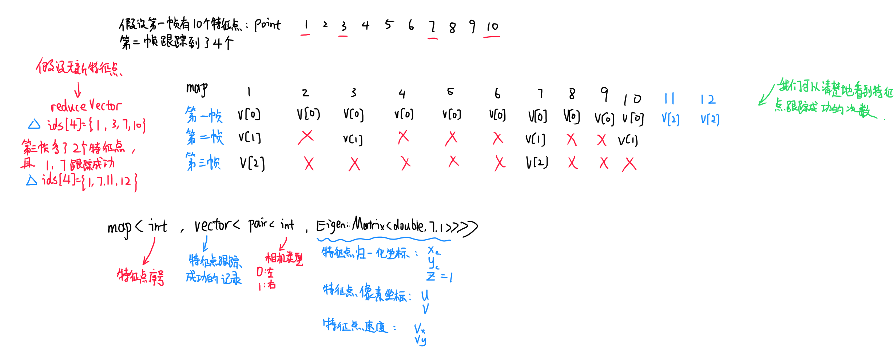

[TOC]


# VINS代码阅读(四)：特征点处理

feature_manager参考：https://blog.csdn.net/shyjhyp11/article/details/125389607

feature_tracker参考：https://zhuanlan.zhihu.com/p/555270835

## 一、概述

​	这部分代码主要用于处理图像、特征提取、特征点匹配跟踪等操作。

### 1.1 特征点跟踪

​	主要在FeatureTracker中，功能是当前帧中跟踪之前的特征点，返回当前帧中跟踪成功的特征点。

### 1.2 所有特征的管理

（给出三个类的关系即可）

## 二、FeatureTracker类：特征点跟踪

主要功能为特征点跟踪。

**部分变量含义：**

```c++
cv::Mat mask;//图像掩码
cv::Mat fisheye_mask;//鱼眼相机mask，用来去除边缘噪点

// prev_img是上一次发布的帧的图像数据
// cur_img是光流跟踪的前一帧的图像数据
// forw_img是光流跟踪的后一帧的图像数据
cv::Mat prev_img, cur_img, forw_img;

vector<cv::Point2f> n_pts;//每一帧中新提取的特征点
vector<cv::Point2f> prev_pts, cur_pts, forw_pts;//对应的图像特征点
vector<cv::Point2f> prev_un_pts, cur_un_pts;//归一化相机坐标系下的坐标
vector<cv::Point2f> pts_velocity;//当前帧相对前一帧特征点沿x,y方向的像素移动速度
vector<int> ids;//能够被跟踪到的特征点的id
vector<int> track_cnt;//当前帧forw_img中每个特征点被追踪的时间次数

map<int, cv::Point2f> cur_un_pts_map;
map<int, cv::Point2f> prev_un_pts_map;

camodocal::CameraPtr m_camera;//相机模型
double cur_time;
double prev_time;

static int n_id;//用来作为特征点id，每检测到一个新的特征点，就将n_id作为该特征点的id，然后n_id加1
```


```c++
class FeatureTracker
{
public:
    FeatureTracker();
    map<int, vector<pair<int, Eigen::Matrix<double, 7, 1>>>> trackImage(double _cur_time, const cv::Mat &_img, const cv::Mat &_img1 = cv::Mat());
    void setMask();
    void readIntrinsicParameter(const vector<string> &calib_file);
    void showUndistortion(const string &name);
    void rejectWithF();
    void undistortedPoints();
    vector<cv::Point2f> undistortedPts(vector<cv::Point2f> &pts, camodocal::CameraPtr cam);
    vector<cv::Point2f> ptsVelocity(vector<int> &ids, vector<cv::Point2f> &pts, 
                                    map<int, cv::Point2f> &cur_id_pts, map<int, cv::Point2f> &prev_id_pts);
    void showTwoImage(const cv::Mat &img1, const cv::Mat &img2, 
                      vector<cv::Point2f> pts1, vector<cv::Point2f> pts2);
    void drawTrack(const cv::Mat &imLeft, const cv::Mat &imRight, 
                                   vector<int> &curLeftIds,
                                   vector<cv::Point2f> &curLeftPts, 
                                   vector<cv::Point2f> &curRightPts,
                                   map<int, cv::Point2f> &prevLeftPtsMap);
    void setPrediction(map<int, Eigen::Vector3d> &predictPts);
    double distance(cv::Point2f &pt1, cv::Point2f &pt2);
    void removeOutliers(set<int> &removePtsIds);
    cv::Mat getTrackImage();
    bool inBorder(const cv::Point2f &pt);

    int row, col;
    cv::Mat imTrack;
    cv::Mat mask;
    cv::Mat fisheye_mask;
    cv::Mat prev_img, cur_img;
    vector<cv::Point2f> n_pts;
    vector<cv::Point2f> predict_pts;
    vector<cv::Point2f> predict_pts_debug;
    vector<cv::Point2f> prev_pts, cur_pts, cur_right_pts;
    vector<cv::Point2f> prev_un_pts, cur_un_pts, cur_un_right_pts;
    vector<cv::Point2f> pts_velocity, right_pts_velocity;
    vector<int> ids, ids_right;
    vector<int> track_cnt;
    map<int, cv::Point2f> cur_un_pts_map, prev_un_pts_map;
    map<int, cv::Point2f> cur_un_right_pts_map, prev_un_right_pts_map;
    map<int, cv::Point2f> prevLeftPtsMap;
    vector<camodocal::CameraPtr> m_camera;
    double cur_time;
    double prev_time;
    bool stereo_cam;
    int n_id;
    bool hasPrediction;
};
```


### 2.1 数据类型说明

首先说明一下数据类型：

```c++
map<int, vector<pair<int, Eigen::Matrix<double, 7, 1>>>> FeatureTracker::trackImage(double _cur_time, const cv::Mat &_img, const cv::Mat &_img1)
    
//数据类型 map<int, vector<pair<int, Eigen::Matrix<double, 7, 1>>>>
Eigen::Matrix<double ,7,1> //表示单独一个特征点的信息：xyz，uv，velocity, 3+2+2
pair<int,Eigen::Matrix<double,7,1>> //int 类型数据0，1表示相机序号：0为左，1为右
vector<> //一个同一个特征点在相机不同位姿下的状态(pair)
map<>    //表示当前跟踪到的所有特征点
```

用一个图表示：



### 2.2 光流法跟踪特征点

```c++
/*
    Step 1、跟踪上一帧
              A、如果是第一帧，跳过Step1，仅做角点提取相关工作
              B、如果是第2、3...帧，需要跟踪上一帧
    */ 

if (prev_pts.size() > 0)
{
    // Step 1.1、正向跟踪
    // prev_pts非空，说明该帧非第一帧，当前帧需要和上一帧做光流追踪
    // 否则的话，直接跳过这部分
    TicToc t_o;
    vector<uchar> status;
    vector<float> err;
    // 是否有一些预测的先验值，因为光流追踪本质上是一个高度非线性的优化问题，如果有更好的初值，就可以使用更少的金字塔层数来实现高精度追踪结果
    if(hasPrediction)
    {
        //有好的先验
        cur_pts = predict_pts;
        // 这里就是使用了两层金字塔（1：0 1）
        //跟踪函数：status表示的是特征点跟踪是否成功，其index对应特征点，0为失败1为成功
        //而对应失败的位置，cur_pts中也是空的。
        cv::calcOpticalFlowPyrLK(prev_img, cur_img, prev_pts, cur_pts, status, err, cv::Size(21, 21), 1, cv::TermCriteria(cv::TermCriteria::COUNT+cv::TermCriteria::EPS, 30, 0.01), cv::OPTFLOW_USE_INITIAL_FLOW);

        int succ_num = 0;
        // 统计跟踪成功的点数
        for (size_t i = 0; i < status.size(); i++)
        {
            if (status[i])
                succ_num++;
        }
        //如果追上的结果有点少，那就使用四层金字塔重新追踪一次（3：0 1 2 3）
        if (succ_num < 10)
            cv::calcOpticalFlowPyrLK(prev_img, cur_img, prev_pts, cur_pts, status, err, cv::Size(21, 21), 3);
    }
    else
        // 当然要是没有好的先验，就和之前一样，使用四层金字塔追踪
        cv::calcOpticalFlowPyrLK(prev_img, cur_img, prev_pts, cur_pts, status, err, cv::Size(21, 21), 3);
    // reverse check
    // Step 1.2、反向跟踪
    // reverse check
    // 双向光流检查，通常我们是用前一帧的结果来追踪后一帧，也可以用后一帧结果来追踪前一帧，做一个double check
    if(FLOW_BACK)
    {
        vector<uchar> reverse_status;
        vector<cv::Point2f> reverse_pts = prev_pts;
        // 由于做过一遍了，置信度也比较高了，所以这里就用两层金字塔了
        cv::calcOpticalFlowPyrLK(cur_img, prev_img, cur_pts, reverse_pts, reverse_status, err, cv::Size(21, 21), 1, 
                                 cv::TermCriteria(cv::TermCriteria::COUNT+cv::TermCriteria::EPS, 30, 0.01), cv::OPTFLOW_USE_INITIAL_FLOW);
        //cv::calcOpticalFlowPyrLK(cur_img, prev_img, cur_pts, reverse_pts, reverse_status, err, cv::Size(21, 21), 3); 
        for(size_t i = 0; i < status.size(); i++)
        {
            //正向和反向都跟踪成功，且跟踪到的点在统一副图像中的距离小于等于0.5像素值，认为跟踪成功。
            if(status[i] && reverse_status[i] && distance(prev_pts[i], reverse_pts[i]) <= 0.5)
            {
                status[i] = 1;
            }
            else
                status[i] = 0;
        }
    }
	// 下面的操作跟之前一直，就是保留被成功追踪的特征点
    // 如果跟踪点超出了图像范围，则剔除
    for (int i = 0; i < int(cur_pts.size()); i++)
        if (status[i] && !inBorder(cur_pts[i]))
            status[i] = 0;
    // 关于ids、track_cnt的说明
    /*
       ids：当有新的特征点进入时，特征点ID号+1，并push_back进入ids里面
       track_cnt：记录特征点成功跟踪的次数
       ATTENTION：ids和track_cnt都只是记录当前帧成功跟踪到的特征点！！！
       如果没有被当前帧成功看到，那么这个点就会从ids和track_cnt中被剔除
       这应该和VINS的某些策略息息相关：因为VINS的关键帧选取就是——次新帧和次次新帧的视差对比，从而判断是丢弃最旧帧或是丢弃次新帧
       这样永远都可以将新帧进行保留，而且不需要过多历史帧信息
    */
    
    //根据status除掉不需要的点
    reduceVector(prev_pts, status);
    reduceVector(cur_pts, status);
    reduceVector(ids, status);
    reduceVector(track_cnt, status);
    ROS_DEBUG("temporal optical flow costs: %fms", t_o.toc());
    //printf("track cnt %d\n", (int)ids.size());
}
```


#### reduceVector函数

```c++
void reduceVector(vector<cv::Point2f> &v, vector<uchar> status)
{
    int j = 0;
    for (int i = 0; i < int(v.size()); i++)
        if (status[i])
            //只有status为1(真)时，向v中写入数据，其他情况i++跳过。
            v[j++] = v[i];
   	//长度变为j
    v.resize(j);
}
```


### 2.3 提取新的特征点

```c++
// Step 2、提取当前帧中新的特征点信息
// 提取新的特征点
if (1)
{
    //通过F剔除外点
    //rejectWithF();
    ROS_DEBUG("set mask begins");
    TicToc t_m;
    // Step 2.2、设置mask。不仅提出密集的特征点，还设置感兴趣区域防止新特征点密集
    setMask();
    ROS_DEBUG("set mask costs %fms", t_m.toc());

    // Step 2.3、提取新的特征点
    ROS_DEBUG("detect feature begins");
    TicToc t_t;
    /*
    MAX_CNT：规定的每帧中能够提取最大数量的特征点
    static_cast<int>(cur_pts.size())：现已有的特征点数量
    n_max_cnt：还能提取的特征点数量
    */ 
    int n_max_cnt = MAX_CNT - static_cast<int>(cur_pts.size());
    if (n_max_cnt > 0)
    {
        if(mask.empty())
            cout << "mask is empty " << endl;
        if (mask.type() != CV_8UC1)
            cout << "mask type wrong " << endl;
        /*void cv::goodFeaturesToTrack(    在mask中不为0的区域检测新的特征点
             *   InputArray  image,              输入图像
             *   OutputArray     corners,        存放检测到的角点的vector
             *   int     maxCorners,             返回的角点的数量的最大值
             *   double  qualityLevel,           角点质量水平的最低阈值（范围为0到1，质量最高角点的水平为1），小于该阈值的角点被拒绝
             *   double  minDistance,            返回角点之间欧式距离的最小值
             *   InputArray  mask = noArray(),   和输入图像具有相同大小，类型必须为CV_8UC1,用来描述图像中感兴趣的区域，只在感兴趣区域中检测角点
             *   int     blockSize = 3,          计算协方差矩阵时的窗口大小
             *   bool    useHarrisDetector = false,  指示是否使用Harris角点检测，如不指定则使用shi-tomasi算法
             *   double  k = 0.04                Harris角点检测需要的k值
             *)   
             */
        cv::goodFeaturesToTrack(cur_img, n_pts, MAX_CNT - cur_pts.size(), 0.01, MIN_DIST, mask);
    }
    else
        n_pts.clear();
    ROS_DEBUG("detect feature costs: %f ms", t_t.toc());
	
    // 若提取到新的特征点，就将新特征点ids、track_cnt更新
    for (auto &p : n_pts)
    {
        cur_pts.push_back(p);
        ids.push_back(n_id++);
        track_cnt.push_back(1);
    }
    //printf("feature cnt after add %d\n", (int)ids.size());
}
```


### 2.4 去畸变并归一化相机平面undistortedPts函数

```c++
cur_un_pts = undistortedPts(cur_pts, m_camera[0]);
```


函数细节

```c++
vector<cv::Point2f> FeatureTracker::undistortedPts(vector<cv::Point2f> &pts, camodocal::CameraPtr cam)
{
    vector<cv::Point2f> un_pts;
    for (unsigned int i = 0; i < pts.size(); i++)
    {
        Eigen::Vector2d a(pts[i].x, pts[i].y);
        Eigen::Vector3d b;
        cam->liftProjective(a, b);
        //去畸变后归一化相机平面
        un_pts.push_back(cv::Point2f(b.x() / b.z(), b.y() / b.z()));
    }
    return un_pts;
}
```


### 2.5 计算特征点速度ptsVelocity函数

```c++
pts_velocity = ptsVelocity(ids, cur_un_pts, cur_un_pts_map, prev_un_pts_map);
```

函数细节

```c++
vector<cv::Point2f> FeatureTracker::ptsVelocity(vector<int> &ids, vector<cv::Point2f> &pts, 
                                            map<int, cv::Point2f> &cur_id_pts, map<int, cv::Point2f> &prev_id_pts)
{
    vector<cv::Point2f> pts_velocity;
    cur_id_pts.clear();
    for (unsigned int i = 0; i < ids.size(); i++)
    {
        cur_id_pts.insert(make_pair(ids[i], pts[i]));
    }

    // caculate points velocity
    if (!prev_id_pts.empty())
    {
        //时间间隔
        double dt = cur_time - prev_time;
        
        for (unsigned int i = 0; i < pts.size(); i++)
        {
            std::map<int, cv::Point2f>::iterator it;
            //在之前特征点map中寻找对应标号的特征点
            it = prev_id_pts.find(ids[i]);
            if (it != prev_id_pts.end())
            {
                //存在这个特征点
                //计算速度 = 像素位置差 / 时间间隔
                double v_x = (pts[i].x - it->second.x) / dt;
                double v_y = (pts[i].y - it->second.y) / dt;
                pts_velocity.push_back(cv::Point2f(v_x, v_y));
            }
            else
                //新特征点，速度为0
                pts_velocity.push_back(cv::Point2f(0, 0));

        }
    }
    else
    {
        for (unsigned int i = 0; i < cur_pts.size(); i++)
        {
            //第一帧特征点速度全为0
            pts_velocity.push_back(cv::Point2f(0, 0));
        }
    }
    return pts_velocity;
}
```


### 2.6 处理最终结果并保存当前特征点信息

```c++
// Step 6、将当前帧的状态进行转移，并保存
// 当前的状态量转换成上一帧的状态量
prev_img = cur_img;
prev_pts = cur_pts;
prev_un_pts = cur_un_pts;
prev_un_pts_map = cur_un_pts_map;
prev_time = cur_time;
hasPrediction = false;

prevLeftPtsMap.clear();
for(size_t i = 0; i < cur_pts.size(); i++)
    prevLeftPtsMap[ids[i]] = cur_pts[i];
// 对结果进行总结
// idx -> （cam id - 性质）
map<int, vector<pair<int, Eigen::Matrix<double, 7, 1>>>> featureFrame;
// 左目帧信息保存
for (size_t i = 0; i < ids.size(); i++)
{
    int feature_id = ids[i];
    // 去畸变的归一化相机坐标
    double x, y ,z;
    x = cur_un_pts[i].x;
    y = cur_un_pts[i].y;
    z = 1;
    // TODO : 没有去畸变的像素坐标？？？看后续在后端优化的时候会不会进行额外处理
    double p_u, p_v;
    p_u = cur_pts[i].x;
    p_v = cur_pts[i].y;
    // 左目的camera id = 0
    int camera_id = 0;
    double velocity_x, velocity_y;
    velocity_x = pts_velocity[i].x;
    velocity_y = pts_velocity[i].y;

    Eigen::Matrix<double, 7, 1> xyz_uv_velocity;
    xyz_uv_velocity << x, y, z, p_u, p_v, velocity_x, velocity_y;
    featureFrame[feature_id].emplace_back(camera_id,  xyz_uv_velocity);
}
```


## 三、FeaturePerFrame类：每个特征点

**表示了图像中的单独特征点数据。**	

| 名称      | 含义                                       |
| --------- | ------------------------------------------ |
| cur_td    | 提取到当前特征点的时间(也就是图像到来时间) |
| point     | 特征点在归一化平面的坐标x , y , z ，且z=1  |
| uv        | 特征点在当前图像中的像素坐标               |
| velocity  | 特征点速度                                 |
| is_stereo | 是否双目                                   |

​	这里，把point，uv，velocity，这三个数据合成到一起，写为Eigen::Matrix<double,7,1>。**这七维向量表示了特征点的大部分信息。**

```c++
class FeaturePerFrame
{
  public:
    FeaturePerFrame(const Eigen::Matrix<double, 7, 1> &_point, double td)
    {
        point.x() = _point(0);
        point.y() = _point(1);
        point.z() = _point(2);
        uv.x() = _point(3);
        uv.y() = _point(4);
        velocity.x() = _point(5); 
        velocity.y() = _point(6); 
        cur_td = td;
        is_stereo = false;
    }
    void rightObservation(const Eigen::Matrix<double, 7, 1> &_point)
    {
        pointRight.x() = _point(0);
        pointRight.y() = _point(1);
        pointRight.z() = _point(2);
        uvRight.x() = _point(3);
        uvRight.y() = _point(4);
        velocityRight.x() = _point(5); 
        velocityRight.y() = _point(6); 
        is_stereo = true;
    }
    double cur_td;
    Vector3d point, pointRight;
    Vector2d uv, uvRight;
    Vector2d velocity, velocityRight;
    bool is_stereo;
};
```

## 四、FeaturePerId类：观察到特征点的图像帧

​	这个类中包含了一幅图像中的所有特征点。

```c++
class FeaturePerId
{
  public:
    const int feature_id;
    int start_frame;
    vector<FeaturePerFrame> feature_per_frame;
    int used_num;
    double estimated_depth;
    int solve_flag; // 0 haven't solve yet; 1 solve succ; 2 solve fail;

    FeaturePerId(int _feature_id, int _start_frame)
        : feature_id(_feature_id), start_frame(_start_frame),
          used_num(0), estimated_depth(-1.0), solve_flag(0)
    {
    }

    int endFrame();
};
```


## 五、FeatureManager类

​	这个类是对所有特征点进行操作的类。包括很多功能函数：**三角化、特征点匹配、特征点提取**等。

```c++
class FeatureManager
{
  public:
    FeatureManager(Matrix3d _Rs[]);

    void setRic(Matrix3d _ric[]);
    void clearState();
    int getFeatureCount();
    bool addFeatureCheckParallax(int frame_count, const map<int, vector<pair<int, Eigen::Matrix<double, 7, 1>>>> &image, double td);
    vector<pair<Vector3d, Vector3d>> getCorresponding(int frame_count_l, int frame_count_r);
    //void updateDepth(const VectorXd &x);
    void setDepth(const VectorXd &x);
    void removeFailures();
    void clearDepth();
    VectorXd getDepthVector();
    void triangulate(int frameCnt, Vector3d Ps[], Matrix3d Rs[], Vector3d tic[], Matrix3d ric[]);
    void triangulatePoint(Eigen::Matrix<double, 3, 4> &Pose0, Eigen::Matrix<double, 3, 4> &Pose1,
                            Eigen::Vector2d &point0, Eigen::Vector2d &point1, Eigen::Vector3d &point_3d);
    void initFramePoseByPnP(int frameCnt, Vector3d Ps[], Matrix3d Rs[], Vector3d tic[], Matrix3d ric[]);
    bool solvePoseByPnP(Eigen::Matrix3d &R_initial, Eigen::Vector3d &P_initial, 
                            vector<cv::Point2f> &pts2D, vector<cv::Point3f> &pts3D);
    void removeBackShiftDepth(Eigen::Matrix3d marg_R, Eigen::Vector3d marg_P, Eigen::Matrix3d new_R, Eigen::Vector3d new_P);
    void removeBack();
    void removeFront(int frame_count);
    void removeOutlier(set<int> &outlierIndex);
    list<FeaturePerId> feature;
    int last_track_num;
    double last_average_parallax;
    int new_feature_num;
    int long_track_num;

  private:
    double compensatedParallax2(const FeaturePerId &it_per_id, int frame_count);
    const Matrix3d *Rs;
    Matrix3d ric[2];
};
```


### 5.1 判断关键帧

#### 5.1.1 流程

1. **遍历当前帧所有特征点**

   

2. **统计跟踪成功的特征点**

3. **计算视差**

   


#### 5.1.2 代码详细说明

```c++
bool FeatureManager::addFeatureCheckParallax(int frame_count, const map<int, vector<pair<int, Eigen::Matrix<double, 7, 1>>>> &image, double td)
{
    ROS_DEBUG("input feature: %d", (int)image.size());
    ROS_DEBUG("num of feature: %d", getFeatureCount());
    double parallax_sum = 0; //所有特征点视差总和
    int parallax_num = 0;
    last_track_num = 0;		//跟踪到的个数
    last_average_parallax = 0;	
    new_feature_num = 0;
    long_track_num = 0;
    for (auto &id_pts : image)
    {
        //f_per_fra 每个特征点
        FeaturePerFrame f_per_fra(id_pts.second[0].second, td);
        assert(id_pts.second[0].first == 0);
        //有关双目相机的处理
        if(id_pts.second.size() == 2)
        {
            f_per_fra.rightObservation(id_pts.second[1].second);
            assert(id_pts.second[1].first == 1);
        }
		
        //特征点id序号
        int feature_id = id_pts.first;
        //这个特征在总特征中出现过 那么我们得到it
        auto it = find_if(feature.begin(), feature.end(), [feature_id](const FeaturePerId &it)
                          {
            return it.feature_id == feature_id;
                          });
		
        //没找到it，那么向总特征中加入这个特征，初始观测到这个特征的帧为：frame_count
        if (it == feature.end())
        {
            feature.push_back(FeaturePerId(feature_id, frame_count));
            feature.back().feature_per_frame.push_back(f_per_fra);
            new_feature_num++;
        }
        //找到了it，那么说明这个特征点是成功跟踪的
        //则把这个特征继续压入在该图像帧中的信息(xyz,uv,vx,vy)
        else if (it->feature_id == feature_id)
        {
            it->feature_per_frame.push_back(f_per_fra);
            last_track_num++;
            if( it-> feature_per_frame.size() >= 4)
                long_track_num++;
        }
    }

    //若图像数小于2 是关键帧
    //若跟踪成功特征点数小于20 是关键帧
    //若多次跟踪成功的点(跟踪成功4次)小于40 是关键帧
    //若新特征比跟踪成功的点的一半要多(意味着新特征很多) 是关键帧
    if (frame_count < 2 || last_track_num < 20 || long_track_num < 40 || new_feature_num > 0.5 * last_track_num)
        return true;
	
    //计算视差：当前与次帧 以及当前与次次帧的视差
    for (auto &it_per_id : feature)
    {
        if (it_per_id.start_frame <= frame_count - 2 &&
            it_per_id.start_frame + int(it_per_id.feature_per_frame.size()) - 1 >= frame_count - 1)
        {
            parallax_sum += compensatedParallax2(it_per_id, frame_count);
            parallax_num++;
        }
    }
	
    //如果第一帧图像，是关键帧
    if (parallax_num == 0)
    {
        return true;
    }
    else
    {
        //如果视差大于某阈值，是关键帧
        ROS_DEBUG("parallax_sum: %lf, parallax_num: %d", parallax_sum, parallax_num);
        ROS_DEBUG("current parallax: %lf", parallax_sum / parallax_num * FOCAL_LENGTH);
        last_average_parallax = parallax_sum / parallax_num * FOCAL_LENGTH;
        return parallax_sum / parallax_num >= MIN_PARALLAX;
    }
}
```


### 5.2 初始化（未完成）


### 5.3 三角化（未完成）


```c++
void FeatureManager::triangulate(int frameCnt, Vector3d Ps[], Matrix3d Rs[], Vector3d tic[], Matrix3d ric[])
{
    for (auto &it_per_id : feature)
    {
        if (it_per_id.estimated_depth > 0)
            continue;

        if(STEREO && it_per_id.feature_per_frame[0].is_stereo)
        {
            int imu_i = it_per_id.start_frame;
            Eigen::Matrix<double, 3, 4> leftPose;
            Eigen::Vector3d t0 = Ps[imu_i] + Rs[imu_i] * tic[0];
            Eigen::Matrix3d R0 = Rs[imu_i] * ric[0];
            leftPose.leftCols<3>() = R0.transpose();
            leftPose.rightCols<1>() = -R0.transpose() * t0;
            //cout << "left pose " << leftPose << endl;

            Eigen::Matrix<double, 3, 4> rightPose;
            Eigen::Vector3d t1 = Ps[imu_i] + Rs[imu_i] * tic[1];
            Eigen::Matrix3d R1 = Rs[imu_i] * ric[1];
            rightPose.leftCols<3>() = R1.transpose();
            rightPose.rightCols<1>() = -R1.transpose() * t1;
            //cout << "right pose " << rightPose << endl;

            Eigen::Vector2d point0, point1;
            Eigen::Vector3d point3d;
            point0 = it_per_id.feature_per_frame[0].point.head(2);
            point1 = it_per_id.feature_per_frame[0].pointRight.head(2);
            //cout << "point0 " << point0.transpose() << endl;
            //cout << "point1 " << point1.transpose() << endl;

            triangulatePoint(leftPose, rightPose, point0, point1, point3d);
            Eigen::Vector3d localPoint;
            localPoint = leftPose.leftCols<3>() * point3d + leftPose.rightCols<1>();
            double depth = localPoint.z();
            if (depth > 0)
                it_per_id.estimated_depth = depth;
            else
                it_per_id.estimated_depth = INIT_DEPTH;
            /*
            Vector3d ptsGt = pts_gt[it_per_id.feature_id];
            printf("stereo %d pts: %f %f %f gt: %f %f %f \n",it_per_id.feature_id, point3d.x(), point3d.y(), point3d.z(),
                                                            ptsGt.x(), ptsGt.y(), ptsGt.z());
            */
            continue;
        }
        else if(it_per_id.feature_per_frame.size() > 1)
        {
            int imu_i = it_per_id.start_frame;
            Eigen::Matrix<double, 3, 4> leftPose;
            Eigen::Vector3d t0 = Ps[imu_i] + Rs[imu_i] * tic[0];
            Eigen::Matrix3d R0 = Rs[imu_i] * ric[0];
            leftPose.leftCols<3>() = R0.transpose();
            leftPose.rightCols<1>() = -R0.transpose() * t0;

            imu_i++;
            Eigen::Matrix<double, 3, 4> rightPose;
            Eigen::Vector3d t1 = Ps[imu_i] + Rs[imu_i] * tic[0];
            Eigen::Matrix3d R1 = Rs[imu_i] * ric[0];
            rightPose.leftCols<3>() = R1.transpose();
            rightPose.rightCols<1>() = -R1.transpose() * t1;

            Eigen::Vector2d point0, point1;
            Eigen::Vector3d point3d;
            point0 = it_per_id.feature_per_frame[0].point.head(2);
            point1 = it_per_id.feature_per_frame[1].point.head(2);
            triangulatePoint(leftPose, rightPose, point0, point1, point3d);
            Eigen::Vector3d localPoint;
            localPoint = leftPose.leftCols<3>() * point3d + leftPose.rightCols<1>();
            double depth = localPoint.z();
            if (depth > 0)
                it_per_id.estimated_depth = depth;
            else
                it_per_id.estimated_depth = INIT_DEPTH;
            /*
            Vector3d ptsGt = pts_gt[it_per_id.feature_id];
            printf("motion  %d pts: %f %f %f gt: %f %f %f \n",it_per_id.feature_id, point3d.x(), point3d.y(), point3d.z(),
                                                            ptsGt.x(), ptsGt.y(), ptsGt.z());
            */
            continue;
        }
        it_per_id.used_num = it_per_id.feature_per_frame.size();
        if (it_per_id.used_num < 4)
            continue;

        int imu_i = it_per_id.start_frame, imu_j = imu_i - 1;

        Eigen::MatrixXd svd_A(2 * it_per_id.feature_per_frame.size(), 4);
        int svd_idx = 0;

        Eigen::Matrix<double, 3, 4> P0;
        Eigen::Vector3d t0 = Ps[imu_i] + Rs[imu_i] * tic[0];
        Eigen::Matrix3d R0 = Rs[imu_i] * ric[0];
        P0.leftCols<3>() = Eigen::Matrix3d::Identity();
        P0.rightCols<1>() = Eigen::Vector3d::Zero();

        for (auto &it_per_frame : it_per_id.feature_per_frame)
        {
            imu_j++;

            Eigen::Vector3d t1 = Ps[imu_j] + Rs[imu_j] * tic[0];
            Eigen::Matrix3d R1 = Rs[imu_j] * ric[0];
            Eigen::Vector3d t = R0.transpose() * (t1 - t0);
            Eigen::Matrix3d R = R0.transpose() * R1;
            Eigen::Matrix<double, 3, 4> P;
            P.leftCols<3>() = R.transpose();
            P.rightCols<1>() = -R.transpose() * t;
            Eigen::Vector3d f = it_per_frame.point.normalized();
            svd_A.row(svd_idx++) = f[0] * P.row(2) - f[2] * P.row(0);
            svd_A.row(svd_idx++) = f[1] * P.row(2) - f[2] * P.row(1);

            if (imu_i == imu_j)
                continue;
        }
        ROS_ASSERT(svd_idx == svd_A.rows());
        Eigen::Vector4d svd_V = Eigen::JacobiSVD<Eigen::MatrixXd>(svd_A, Eigen::ComputeThinV).matrixV().rightCols<1>();
        double svd_method = svd_V[2] / svd_V[3];
        //it_per_id->estimated_depth = -b / A;
        //it_per_id->estimated_depth = svd_V[2] / svd_V[3];

        it_per_id.estimated_depth = svd_method;
        //it_per_id->estimated_depth = INIT_DEPTH;

        if (it_per_id.estimated_depth < 0.1)
        {
            it_per_id.estimated_depth = INIT_DEPTH;
        }

    }
}
```


