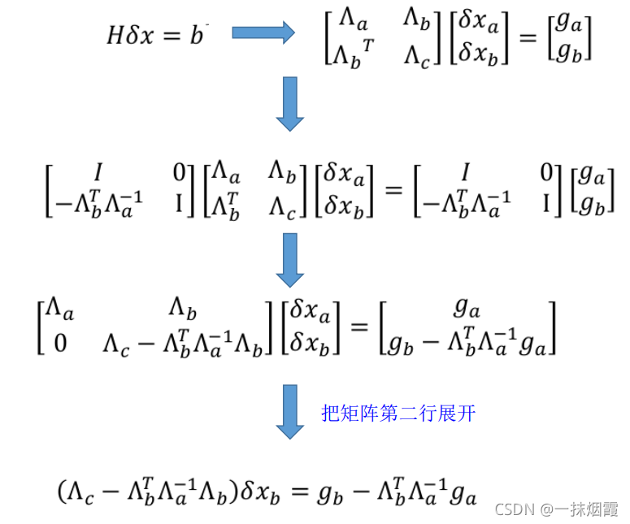
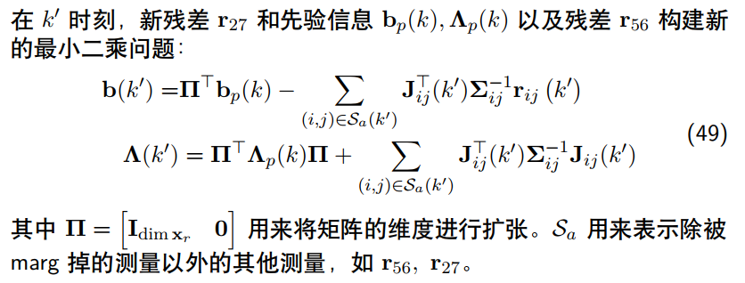
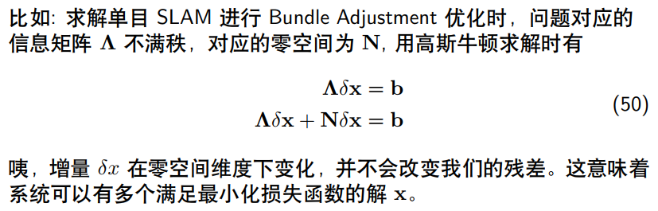

# 基于滑动窗口算法的VIO系统

## 一、高斯分布及信息矩阵

### 1、SLAM问题概率建模

​	**考虑某个状态ξ，以及一次与该变量相关的观测ri。由于噪声的存在，观测服从概率分布p(ri|ξ)。**在状态下的测量附带噪声。

​	**我们考虑多次观测，**
$$
p(r|ξ)=∏_{i}p(r_i|ξ)
$$
若我们知道先验信息p(ξ)，如GPS，车轮码盘信息或根据运动方程预测(卡尔曼滤波)，我们再用贝叶斯搞到后验概率：
$$
p(ξ|r)=\frac{p(r|ξ)p(ξ)}{p(r)}
$$
最大后验估计，得到系统状态的最优估计：
$$
ξ_{MAP}=argmax_{ξ}p(ξ|r)
$$
除去与ξ无关的分母p(r)，我们得到：
$$
ξ_{MAP}=argmax_{ξ}\prod_i p(r_i|ξ)p(ξ)
$$
取log
$$
ξ_{MAP} = arg min_
ξ [−∑_i ln( p (r_i|ξ)) − ln (p(ξ))]
$$
我们考虑高斯分布情况，可以得到：


利用最小二乘求解：


### 2、高斯分布和协方差矩阵及信息矩阵

*我们将协方差矩阵的逆记作信息矩阵*

​	我们想在变量维数变多时，从多元高斯分布中丢弃变量( p(x,y)->p(x)/p(y) )。我们举一个简单的例子：

#### i. 例1：温度

​	设x2为室外温度，x1,x3分别为房间1和房间3的室内温度，如图所示


其中：
$$
x_2=v_2\\
x_1=w_1x_2+v_1\\
x_3=w_3x_2+v_3
$$
其中，噪声vi相互独立，且个自服从协方差为σi^2的高斯分布。

我们现在计算各个xi间的协方差：


​	**我们现在计算联合高斯分布从而得到协方差矩阵的逆：**(x1x3独立)
$$
p(x_1x_2x_3)\\
\\=p(x_1x_3|x_2)p(x_2) \ \ \ \ \ \ \ \ \ \ \ \ 
\\
=p(x_2)p(x_1|x_2)p(x_3|x_2)
$$
我们利用指数性质求出联合概率分布


​	我们通过上述计算得到**例1对应的信息矩阵：**


**信息矩阵中有两个元素为0，含义：若协方差逆矩阵(信息矩阵)坐标(i,j)的元素为0，表示元素i,j关于其他变量条件独立**
$$
p(x_ix_j|x_k...)=p(x_i|x_k...)p(x_j|x_k...)
$$

#### ii. 协方差元素正负与信息矩阵元素正负代表什么

根据例1，假设室内温度与室外温度正相关(w>0)

- 协方差中非对角元素Σij>0表示两变量正相关
- 信息矩阵中非对角元素为负数，甚至为0。Λ12 <0表示在变量x3(其他变量)发生的条件下，元素x1和x2正相关

#### iii. 例2


两个相机pose得到特征点三维坐标：
$$
x_2=w_1x_1+w_3x_3+v_2
$$
我们直接得到协方差矩阵：


协方差矩阵中非对角元素为0表示变量之间没有相关性，但信息矩阵中该位置不一定为零。如下：


根据例2，得到结论：

- 虽然 x1 和 x3 不相关，但是不说明他们的信息矩阵对应元素 Λ13为 0。 
- 恰恰信息矩阵中 Λ13 > 0, 表示的是在变量 x2 发生的条件下，变量 x1, x3 成负相关。
- 对应上面的例子即 x2 为常数，如果 x1 大，则 x3 小。

这里可以用贝叶斯公式来给出上述结论
$$
p(x_2|x_1x_3)=\frac{p(x_1x_3|x_2)p(x_2)}{p(x_1x_3)}\\
=\frac{....}{p(x_1)p(x_3)}\\若x_2发生，则p(x_1)大p(x_3)小
$$

#### iv. 去除变量(滑动窗口)

比如去掉上述例1中的x3：协方差矩阵直接干掉第三行第三列即可


而对应信息矩阵变化，**先给结论：**


​	对于信息矩阵，我们要引入**边缘化(marginalization)和Schur's complement(舒尔补)**来解决这个问题。

## 二、舒尔补应用

*我们可以用舒尔补来分解多元高斯分布为边界概率和条件概率*

### 1、概念

#### i. 定义


这个舒尔补是将M变成对角矩阵后，第二块对角块矩阵的值。

​	将M矩阵变为对角矩阵：
$$
\begin{bmatrix}
I&0\\-CA^{-1}&I
\end{bmatrix}
\begin{bmatrix}
A&B\\C&D
\end{bmatrix}
\begin{bmatrix}
I&-A^{-1}B\\0&I
\end{bmatrix}=
\begin{bmatrix}
A&0\\0&\Delta_A
\end{bmatrix}
$$
其中，ΔA为A关于M的舒尔补->D-CA^{-1}B。

#### ii. 舒尔补分解的好处：


#### iii. 从初等矩阵角度理解舒尔补分解

舒尔补是把一个矩阵变成了对角阵。我们先回顾一下初等矩阵：

详细介绍：https://blog.csdn.net/hpdlzu80100/article/details/99722636

​	**定义：由单位矩阵I经过一次初等变换得到的矩阵为初等矩阵。**

​	**定理：对一个s×n矩阵A作一次初等行（列）变换就相当于在A的左（右）边乘上相应的s×s维初等矩阵。**

​	**定义：矩阵A与B，若B可以由A经过一系列初等变换得到，则A与B称为等价的。**

初等矩阵包括：

​	①互换矩阵I的第i行和第j行，用P( i，j )表示。

​	②用数域P中非零数c乘I的第i行，用P( i ( c ) )表示。

​	③把矩阵I的第j行乘k倍加到i行，用P( i，j ( k ) )表示。

这样看来，我们要得到两个初等矩阵并不难，首先是行变换：1行×-CA-1加到第二行，就是左乘：
$$
\begin{bmatrix}
I&0\\-CA^{-1}&I
\end{bmatrix}
$$
之后，把第一列×-A-1B加到第二列，就是右乘：
$$
\begin{bmatrix}
I&-A^{-1}B\\0&I
\end{bmatrix}
$$
有了这两个矩阵，我们可以算出矩阵X的舒尔补。

### 2、分解多元高斯分布

​	假设多元变量x服从高斯分布，且由两部分组成：x=[a b]^T，变量之间构成的协方差矩阵为：
$$
K=\begin{bmatrix}
A&C^T\\C&D
\end{bmatrix}
$$
其中，
$$
A=cov(a,a),D=cov(b,b),C=cov(a,b)
$$
利用舒尔补(快速求逆)对高斯分布进行分解，得到：


### 3、分解后的信息矩阵

我们直接解协方差的逆即可，用上述公式(舒尔补求逆)


我们得到：
$$
条件概率p(b|a)的协方差为:Δ_A\\
条件概率p(b|a)的信息矩阵为:Δ_A^{-1}=Λ_{bb}\\
边界概率p(a)的协方差为：A\\
边界概率p(a)的信息矩阵为:A^{-1}=Λ_{aa} − Λ_{ab}Λ^{-1}_{bb}Λ_{ba}
$$

#### 回顾例1：

​	我们根据公式即可算出，边缘化x3后，p(x1,x2)对应的信息矩阵


### 4、总结

​	边界概率对于协方差矩阵的操作是很容易的，但不好操作信息矩阵；条件概率容易操作信息矩阵，但不好操作协方差矩阵。

表格总结如下：


## 三、滑动窗口算法

*我们不想太多时刻状态进行优化，因此采取滑动窗口*

我们弄一个简单的情况：


对于上述最小二乘问题，对应的高斯牛顿求解为：
$$
J^TΣ^{-1}Jδξ=-J^TΣ^{-1}r\\
令Λ=Σ^{-1}_{new}=J^TΣ^{-1}J\\
设个Λ是GN法中的系数矩阵，Σ^{-1}是残差的信息矩阵
$$
其中，雅可比为：


#### ·基于边际概率的滑动窗口算法

移除老变量的做法：


再看一个例子


marginalization 边缘化会使得信息矩阵变稠密，原先条件独立的变量，可能会变得相关。

#### ·一些matlab代码

​	我们想通过边缘化来减少优化变量，比如：
$$
p(a,b)->边缘化b->p(a)
$$
但是b和a一般是有关系的，所以这里不能直接去除。一般情况下，我们优化过程中已知p(a,b)的信息矩阵。根据上述讲解，我们可以通过求逆得到协方差矩阵，再删去有关被边缘的变量项，再求逆得到信息矩阵。**但是，对于庞大矩阵求逆是非常困难的，因此我们不能这么做。**

​	所以，我们要通过之前的信息矩阵来求得现在的信息矩阵，直接通过舒尔补即可得到p(a)的信息矩阵。**这个过程中也要求逆，但是只求一小块矩阵的逆，计算速度很快。**

​	我们通过matlab验证：p(a,b)中，边缘化b，只留下p(a)。一个是直接协方差的计算，一个是通过信息矩阵的计算，最终得到的分布是相同的。

```matlab
clear;clc;close;

%three value example
sigma1=0.5;sigma2=0.6;sigma3=1.0;
mu1=1.0;mu2=0;mu3=1.5;

Sigma1=[mu1^2*sigma2^2+sigma1^2,mu1*sigma2^2,mu1*mu3*sigma2^2;
    mu1^2*sigma2^2,sigma2^2,mu3*sigma2^2;
    mu1*mu3*sigma2^2,mu3*sigma2^2,mu3^2*sigma2^2+sigma3^2]
Gamma1=inv(Sigma1)


%
N=1;
x=normrnd(0,0.5,1,N);
scatter(1:N,x)
y=2*x;
hold on;
scatter(1:N,y)
hold off;


%---------utilz schur to marginalize
clear;clc;
sigma=[0.5,0.5,1.0];
omega=[2,0,1];
mu1=0.0;
x2=normrnd(mu1,sigma(2),1,1000);
x1=normrnd(0,sigma(3),1,1000);
x3=x1+x2;
%x3=normrnd(0,1.25,1,1000);
%x1=omega(1).*x2+normrnd(0,sigma(1)^2,1,1000);
h2=histogram(x2)
h3=histogram(x3)
%marg x2 see x3
Cov=[sigma(2)^2,omega(3)*sigma(2)^2;
    omega(3)*sigma(2)^2,omega(3)^2*sigma(2)^2+sigma(3)^2]
Info=inv(Cov)

Info_x3=Info(2,2)-Info(1,2)*inv(Info(1,1))*Info(2,1)
Info_x3_x2 = Info(1,1);
Cov_x3=inv(Info_x3);
Cov_x3_x2 = inv(Info_x3_x2);

x3_new=normrnd(Cov(2,1)*inv(Cov(1,1))*mu1,sqrt(Cov_x3),1,1000);
x3_x2=normrnd(0.0,sqrt(Cov_x3_x2),1,1000);
h3_new=histogram(x3_new)

sigma3=checkGaussian(x3)
sigma3_new=checkGaussian(x3_new)
sigma_x3_x2=checkGaussian(x3_x2)


function [sigma]=checkGaussian(data)
    const=[0.6827,0.9545,0.9973];
    %mean = 0
    data = abs(data);
    data = sort(data);
    
    N = size(data,2);
    x1=data(round(N*const(1)));
    x2=data(round(N*const(2)));
    x3=data(round(N*const(3)));
    
    sigma1 = x1;
    sigma2 = x2/2;
    sigma3 = x3/3;
    
    sigma = (sigma1+sigma2+sigma3)/3;
end

```

通过高斯拟合后，容易得到x3 和 x3_new的分布相同。

## 四、滑动窗口中的FEJ算法

​	在example 3中，再移除变量ξ1后加入新变量：如图所示


新变状态只与状态2有关，因此可以将其加入先前的信息矩阵，但系统可能存在风险：因为2-7和2-1的数据加到了一起。


#### 1、边缘化后留下的先验



这就是边缘化后，**优化过程中H矩阵与b矩阵的变化**。上述讲解都是有关待优化变量的信息矩阵，这里直接边缘化**那个构造出的稀疏矩阵H**。这可能出现的问题是：**这里得到的新矩阵H可以认为是目前几个待优化变量的先验(被边缘化的信息加入到其中)，其关于这些变量的雅可比不能更新。**原因：之前的测量残差虽然已经加入，但是其实已经被丢弃，因此不能求解雅可比。

​	比如：x1,x2,x3,x4,x5。边缘化了x1，导致x2,x3的先验变化(x1的测量信息传递给了x2,x3。x4,x5和x1没有关系)。这时候，x2和x3的雅可比就求不了了，就当不变了。

#### 2、新测量信息和旧测量信息构建新系统



上述公式表示：**先求边缘化后的信息矩阵和残差(b和H)，再进行扩维，最后加上新的测量的信息矩阵(J^TΣJ)和残差(J^TΣe)。**

#### 3、信息矩阵的零空间变化

​	滑动窗口算法优化的时候，信息矩阵如公式(49)变成了两部分，且这两部分**计算雅可比时线性化点不同**。这可能会导致**信息矩阵的零空间发生变化，从而在求解时引入错误信息。**




https://blog.csdn.net/qq_34213260/article/details/120359990


