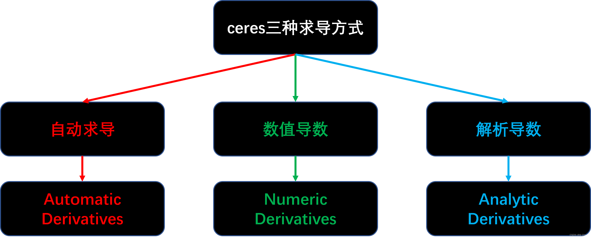

[TOC]


# Ceres的用法

## 一、简单曲线拟合

### 1.1 问题推导

给出一个拟合曲线的问题，其中用到了Ceres提供的自动求导。Ceres只接受最小二乘优化：
$$
min\ e^Te
$$

#### 1.1.1 问题概述：

$$
y=e^{ax^2+bx_i+c}
$$

根据x生成带有噪声的y测量值：
$$
y_{meas}=e^{ax_i^2+bx_i+c}+n\\n =N(\mu,\sigma^2)
$$
使用GN法解决这个问题，推导：


### 1.2 代码

利用了自动求导

```c++
#include <iostream>

#include <opencv2/core/core.hpp>
#include <ceres/ceres.h>

#include <chrono>

using namespace std;

cv::RNG rng;

// 代价函数的计算模型
struct CURVE_FITTING_COST
{
    CURVE_FITTING_COST ( double x, double y ) : _x ( x ), _y ( y ) {}
    // 残差的计算
    template <typename T>
    bool operator() (
    const T* const abc, // 模型参数,有 3 维
    T* residual ) const // 残差
    {
        // y-exp(ax^2+bx+c)
        residual[0] = T ( _y ) - ceres::exp ( abc[0]*T ( _x ) *T ( _x ) + abc[1]*T ( _x ) + abc[2] );
        return true;
    }
    const double _x, _y; // x,y 数据
};

//生成数据
void GenerateData(int N,double sigma,std::vector<double> &arr_x,std::vector<double> &arr_y,
                                            double (*fx)(double x,double a,double b,double c,double sigma))
{
    arr_x.clear();
    arr_y.clear();
    double a=1.0,b=2.0,c=1.0;
    for(int i=0;i<N;++i)
    {
        double x=double(i)/100.0;
        double y=fx(x,a,b,c,sigma);

        arr_x.push_back(x);
        arr_y.push_back(y);

        cout<<x<<" "<<y<<endl;
    }
}

//要拟合的方程
double fx(double x,double a,double b,double c,double sigma)
{
    return (exp(a*x*x+b*x+c)+rng.gaussian(sigma));
}

int main()
{
    cout<<"Begin Ceres test!"<<endl;
    cout<<"generating data: "<<endl;
    int N=100;
    double sigma=1.0;
    double abc[3]={0,0,0};

    std::vector<double> x_data;
    std::vector<double> y_data;

    GenerateData(N,sigma,x_data,y_data,fx);
    //Start optimize
    //构建最小二乘问题
    ceres::Problem problem;
    for(int i=0;i<N;i++)
    {
        problem.AddResidualBlock(
            new ceres::AutoDiffCostFunction<CURVE_FITTING_COST,1,3>(new CURVE_FITTING_COST(x_data[i],y_data[i]))
            ,nullptr,abc);
    }

    // 配置求解器
    ceres::Solver::Options options; // 这里有很多配置项可以填
    options.linear_solver_type = ceres::DENSE_QR;// 增量方程如何求解
    options.minimizer_progress_to_stdout = true;// 输出到cout

    ceres::Solver::Summary summary; //优化信息
    chrono::steady_clock::time_point t1 = chrono::steady_clock::now();
    ceres::Solve ( options, &problem, &summary ); // 开始优化
    chrono::steady_clock::time_point t2 = chrono::steady_clock::now();
    chrono::duration<double> time_used = chrono::duration_cast<chrono::duration<double>>( t2-t1 );
    cout<<"solve time cost = "<<time_used.count()<<" seconds. "<<endl;

    // 输出结果
    cout<<summary.BriefReport() <<endl;
    cout<<"estimated a,b,c = ";
    for ( auto a:abc ) cout<<a<<" ";
    cout<<endl;
    
    return 0;
}
```

## 二、Ceres的几种求导方式

参考：https://blog.csdn.net/qq_39400324/article/details/126827389



### 2.1 自动求导

如`1.2`中的代码就用了自动求导，再举个例子

```c++
struct CostFunctor {
   template <typename T>
   bool operator()(const T* const x, T* residual) const {
     residual[0] = 10.0 - x[0];
     return true;
   }
};

int main(int argc, char** argv) {
  
  // 定义要优化求解的变量，并赋予初值
  double initial_x = 5.0;
  double x = initial_x;

  // 构建problem
  ceres::Problem problem;

  // 设置求导方式为自动求导，并添加代价函数残差项（CostFunctor）
  ceres::CostFunction* cost_function =
      new ceres::AutoDiffCostFunction<CostFunctor, 1, 1>(new CostFunctor);
  problem.AddResidualBlock(cost_function, nullptr, &x);

  // 运行优化器
  ceres::Solver::Options options;
    options.linear_solver_type = ceres::DENSE_QR;
    options.minimizer_progress_to_stdout = true;
  ceres::Solver::Summary summary;
  ceres::Solve(options, &problem, &summary);

  std::cout << summary.BriefReport() << "\n";
  std::cout << "x : " << initial_x  << " -> " << x << "\n";
  return 0;
}
```

### 2.2 数值微分

*通常，这种方式不推荐使用。*

#### 2.2.1 理论

理论部分见`数值分析`

#### 2.2.2 代码应用

​	有些情况下，系统无法求得代价函数的导数，即无法使用自动求导的方式对代价函数进行求导，这时候就要用数值微分的形式。

```c++
struct CostFunctor {
  bool operator()(const double* const x, double* residual) const {
    residual[0] = 10.0 - x[0];
    return true;
  }
};

int main(int argc, char const *argv[])
{
    //定义优化的变量及其初值
    double initial_x=5.0;
    double x=initial_x;

    //构建problem
    ceres::Problem problem;

    //使用数值导数的方式，并添加代价函数，残差项（CostFunctor）
    ceres::CostFunction* cost_function=
        new ceres::NumericDiffCostFunction<CostFunctor,ceres::CENTRAL,1,1>(new CostFunctor);
    problem.AddResidualBlock(cost_function,nullptr,&x);

    //运行优化器
    ceres::Solver::Options options;
    options.minimizer_progress_to_stdout=true;
    ceres::Solver::Summary summary;
    ceres::Solve(options,&problem,&summary);
    std::cout<<summary.BriefReport()<<std::endl;
    std::cout<<"x : "<<initial_x<<" -> "<<x<<std::endl;

    return 0;
}

```

### 2.3 解析导数

​	有的时候使用自动求导的方式对代价函数求导并不有效，我们可以自己写解析导数对代价函数进行求导。

​	**我们在这里，自行求解导数，修改1.2节中的代码，观察结果。**

```c++
#include <iostream>

#include <opencv2/core/core.hpp>
#include <ceres/ceres.h>

#include <chrono>

using namespace std;

cv::RNG rng;

//#define AUTODIFF
#define JACOBIAN

//解析导数
class QuadraticCostFunction : public ceres::SizedCostFunction<1/*残差个数*/,3/*参数量*/>
{
    public:
        QuadraticCostFunction(double x,double y)
        {
            _x=x;
            _y=y;
        }

        bool Evaluate(double const* const* parameters,
        double* residuals,
        double** jacobians) const override
        {
            const double a=parameters[0][0];
            const double b=parameters[0][1];
            const double c=parameters[0][2];
            double f = ceres::exp ( a* _x  * _x  + b* _x  + c );
            residuals[0] =  _y-f;

            if (!jacobians) return true;
            double* jacobian = jacobians[0];
            if (!jacobian) return true;


            jacobians[0][0]=-f*_x*_x;
            jacobians[0][1]=-f*_x;
            jacobians[0][2]=-f;
            // jacobians[0][0]=-_x*_x;
            // jacobians[0][1]=-_x;
            // jacobians[0][2]=-1;

            return true;
        }
    private:
        double _y,_x;
};


// 代价函数的计算模型
struct CURVE_FITTING_COST
{
    CURVE_FITTING_COST ( double x, double y ) : _x ( x ), _y ( y ) {}
    // 残差的计算
    template <typename T>
    bool operator() (
    const T* const abc, // 模型参数,有 3 维
    T* residual ) const // 残差
    {
        // y-exp(ax^2+bx+c)
        residual[0] = T ( _y ) - ceres::exp ( abc[0]*T ( _x ) *T ( _x ) + abc[1]*T ( _x ) + abc[2] );
        return true;
    }
    const double _x, _y; // x,y 数据
};

void GenerateData(int N,double sigma,std::vector<double> &arr_x,std::vector<double> &arr_y,
                                            double (*fx)(double x,double a,double b,double c,double sigma))
{
    arr_x.clear();
    arr_y.clear();
    double a=1.0,b=2.0,c=1.0;
    for(int i=0;i<N;++i)
    {
        double x=double(i)/100.0;
        double y=fx(x,a,b,c,sigma);

        arr_x.push_back(x);
        arr_y.push_back(y);

        cout<<x<<" "<<y<<endl;
    }
}

double fx(double x,double a,double b,double c,double sigma)
{
    return (ceres::exp(a*x*x+b*x+c)+rng.gaussian(sigma));
    //return (a*x*x+b*x+c+rng.gaussian(sigma));
}

int main()
{
    cout<<"Begin Ceres test!"<<endl;
    cout<<"generating data: "<<endl;
    int N=100;
    double sigma=1.0;
    double abc[3]={0,0,0};

    std::vector<double> x_data;
    std::vector<double> y_data;

    GenerateData(N,sigma,x_data,y_data,fx);
    //Start optimize
    //构建最小二乘问题
    ceres::Problem problem;
    ceres::LossFunction* loss_function=new ceres::HuberLoss(1.0);
    for(int i=0;i<N;i++)
    {
    #ifdef AUTODIFF
        problem.AddResidualBlock(
            new ceres::AutoDiffCostFunction<CURVE_FITTING_COST,1,3>(new CURVE_FITTING_COST(x_data[i],y_data[i]))
            ,nullptr,abc);
    #endif

    #ifdef JACOBIAN
        ceres::CostFunction* cost_function=new QuadraticCostFunction(x_data[i],y_data[i]);
        problem.AddResidualBlock(cost_function,loss_function,abc);

    #endif
    }

    // 配置求解器
    ceres::Solver::Options options; // 这里有很多配置项可以填
    options.linear_solver_type = ceres::DENSE_QR;// 增量方程如何求解
    options.minimizer_progress_to_stdout = true;// 输出到cout

    ceres::Solver::Summary summary; //优化信息
    chrono::steady_clock::time_point t1 = chrono::steady_clock::now();
    ceres::Solve ( options, &problem, &summary ); // 开始优化
    chrono::steady_clock::time_point t2 = chrono::steady_clock::now();
    chrono::duration<double> time_used = chrono::duration_cast<chrono::duration<double>>( t2-t1 );
    cout<<"solve time cost = "<<time_used.count()<<" seconds. "<<endl;

    // 输出结果
    cout<<summary.BriefReport() <<endl;
    cout<<"estimated a,b,c = ";
    for ( auto a:abc ) cout<<a<<" ";
    cout<<endl;
    
    return 0;
}
```

结果

```shell
iter      cost      cost_change  |gradient|   |step|    tr_ratio  tr_radius  ls_iter  iter_time  total_time
   0  1.330400e+03    0.00e+00    9.93e+01   0.00e+00   0.00e+00  1.00e+04        0    1.69e-05    5.98e-05
   1  2.165849e+18   -2.17e+18    9.93e+01   5.53e+01  -3.23e+15  5.00e+03        1    2.29e-05    9.68e-05
   2  2.101742e+18   -2.10e+18    9.93e+01   5.52e+01  -3.14e+15  1.25e+03        1    1.00e-05    1.13e-04
   3  1.762189e+18   -1.76e+18    9.93e+01   5.44e+01  -2.63e+15  1.56e+02        1    8.11e-06    1.27e-04
   4  4.475312e+17   -4.48e+17    9.93e+01   4.89e+01  -6.69e+14  9.77e+00        1    7.87e-06    1.40e-04
   5  4.884946e+14   -4.88e+14    9.93e+01   2.85e+01  -7.53e+11  3.05e-01        1    7.15e-06    1.52e-04
   6  9.761892e+05   -9.75e+05    9.93e+01   8.52e+00  -2.41e+03  4.77e-03        1    6.91e-06    1.64e-04
   7  1.315249e+03    1.52e+01    1.14e+02   2.18e-01   1.11e+00  1.43e-02        1    2.00e-05    1.89e-04
   8  1.261058e+03    5.42e+01    1.68e+02   5.25e-01   1.32e+00  4.29e-02        1    1.79e-05    2.12e-04
   9  1.056559e+03    2.04e+02    3.71e+02   8.54e-01   1.74e+00  1.29e-01        1    1.81e-05    2.35e-04
  10  6.129271e+02    4.44e+02    8.07e+02   6.58e-01   1.81e+00  3.86e-01        1    1.79e-05    2.57e-04
  11  2.518686e+02    3.61e+02    1.02e+03   2.75e-01   1.64e+00  1.16e+00        1    1.79e-05    2.79e-04
  12  2.038241e+02    4.80e+01    7.69e+02   4.06e-02   1.37e+00  3.48e+00        1    1.81e-05    3.01e-04
  13  1.754274e+02    2.84e+01    6.16e+02   5.30e-02   1.31e+00  1.04e+01        1    1.79e-05    3.24e-04
  14  1.356763e+02    3.98e+01    5.14e+02   1.31e-01   1.22e+00  3.13e+01        1    1.79e-05    3.46e-04
  15  8.252231e+01    5.32e+01    3.14e+02   2.32e-01   1.26e+00  9.39e+01        1    1.81e-05    3.68e-04
  16  5.428320e+01    2.82e+01    6.40e+01   2.08e-01   1.25e+00  2.82e+02        1    1.91e-05    3.91e-04
  17  4.792203e+01    6.36e+00    3.59e+01   1.49e-01   1.20e+00  8.45e+02        1    2.00e-05    4.15e-04
  18  4.586221e+01    2.06e+00    1.89e+01   2.08e-01   1.10e+00  2.53e+03        1    1.79e-05    4.37e-04
  19  4.469275e+01    1.17e+00    4.52e+00   2.37e-01   1.12e+00  7.60e+03        1    1.79e-05    4.59e-04
  20  4.430680e+01    3.86e-01    5.82e+00   1.66e-01   1.21e+00  2.28e+04        1    1.81e-05    4.81e-04
  21  4.423624e+01    7.06e-02    3.90e+00   7.75e-02   1.27e+00  6.84e+04        1    1.81e-05    5.03e-04
  22  4.422721e+01    9.03e-03    1.99e+00   2.83e-02   1.30e+00  2.05e+05        1    1.79e-05    5.25e-04
  23  4.422621e+01    1.01e-03    8.79e-01   9.31e-03   1.32e+00  6.16e+05        1    1.79e-05    5.47e-04
  24  4.422610e+01    1.10e-04    3.58e-01   2.97e-03   1.33e+00  1.85e+06        1    1.81e-05    5.70e-04
solve time cost = 0.0005938 seconds. 
Ceres Solver Report: Iterations: 25, Initial cost: 1.330400e+03, Final cost: 4.422610e+01, Termination: CONVERGENCE
estimated a,b,c = 0.948737 2.10189 0.961805
```

TRUE : a=1.0 b=2.0 c=1.0


