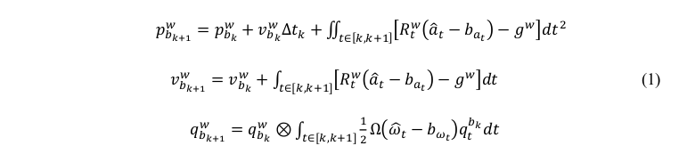
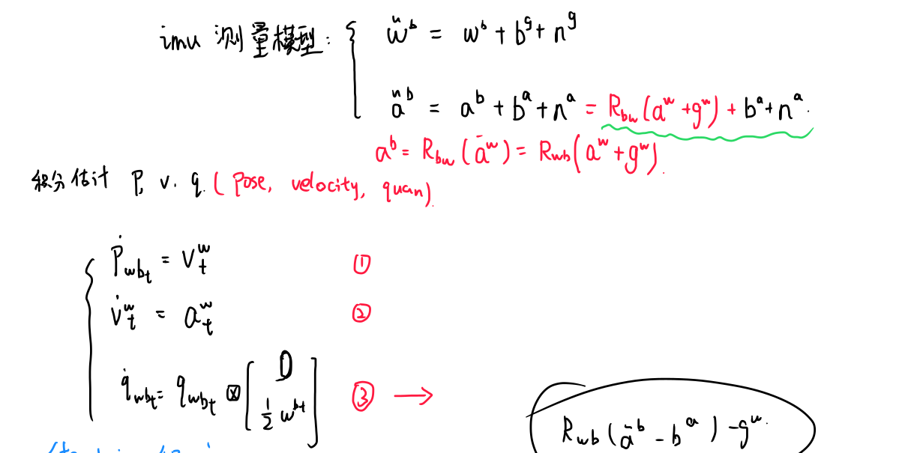
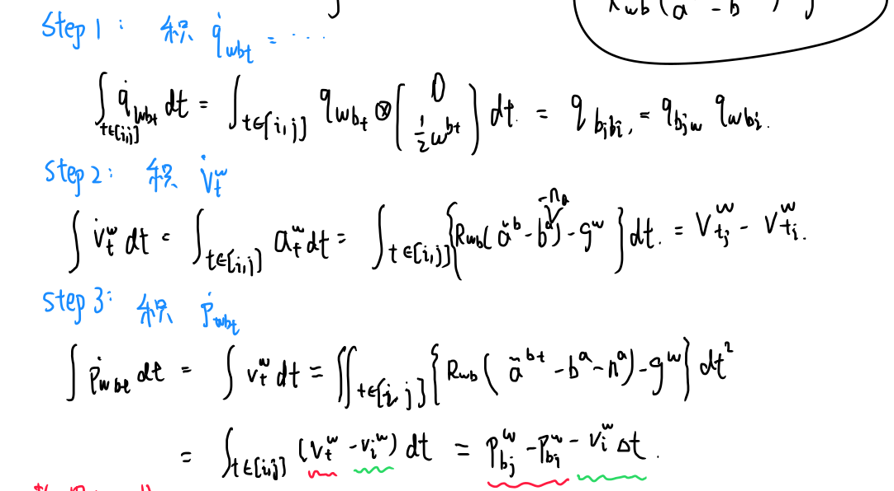
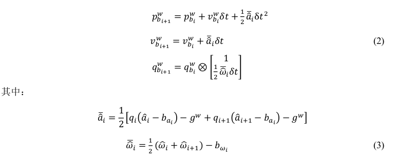
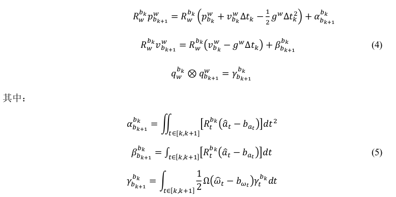
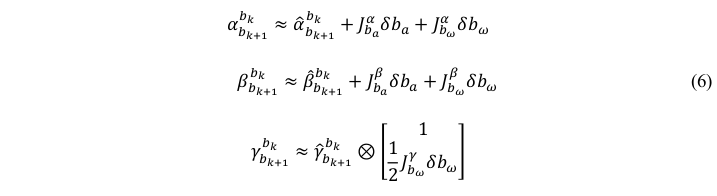
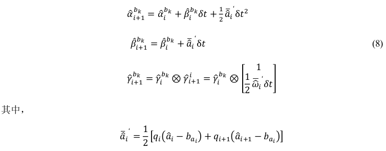
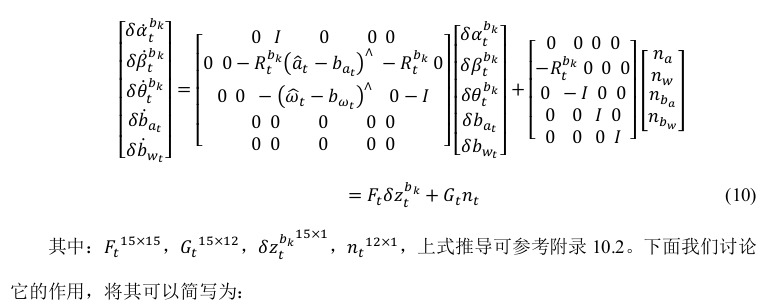
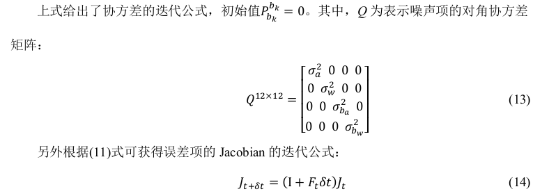
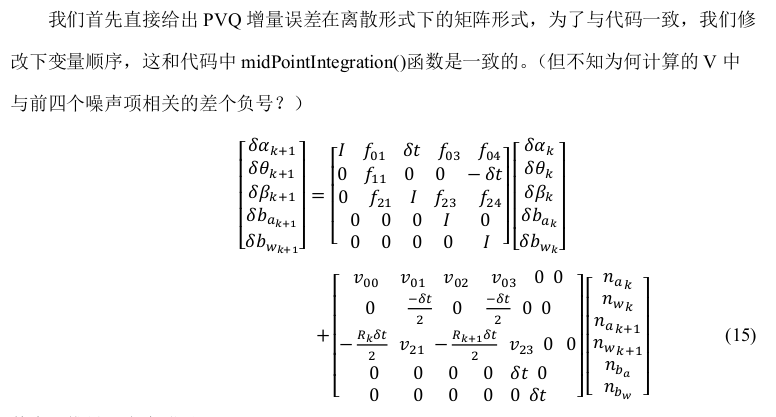

[TOC]

# IMU预积分详细过程

## 一、理论过程

### 1.1 PVQ连续值积分

​	将第 k 帧和第 k+1 帧之间的所有 IMU 进行积分,可得第 k+1 帧的位置、速度和旋转(PVQ),作为视觉估计的初始值,这里的旋转采用的四元数。

​	类比，简单形式：已知加速度，v0，x0和时间间隔，那么可以轻易求出当前时刻速度和位置。
$$
v_1=v_0+a\Delta t\\
x_1=x_0+v_0t+\frac{1}{2}a\Delta t^2
$$
我们得到当前时刻PVQ（连续形式）

手动推导一下：

### 1.2 PVQ离散值积分（中值积分）

#### 1.2.1 理论推导公式

**中值积分：每一个小时刻的采样点的均值 乘 小时间间隔，再进行累加。**

​	由于得到的测量值非连续，因此在计算机处理中必须离散化积分：为了与代码保持一致，我们推导PVQ离散中值积分：

手动推导一下：

#### 1.2.2 对应代码变量

​	从第 i 个 IMU 时刻到第 i+1 个 IMU 时刻的积分过程,这与Estimator::processIMU()函数中的 Ps[j]、Rs[j]和 Vs[j]是一致的(代码中的 j 时刻即为此处的i+1),IMU 积分出来的第 j 时刻的物理量可以作为第 j 帧图像的初始值。

### 1.3 两帧之间PVQ增量的连续形式(预积分)

​	通过观察公式(1)可知，IMU的预积分需要依赖与第k帧的v和R，当我们在后端进行非线性优化时，需要迭代更新第k帧的v和R，这将导致我们需要根据每次迭代后值重新进行积分，非常浪费时间。因此，我们考虑将优化变量从第k帧到第k+1帧的IMU预积分项中分离开来，通过对公式(1)左右两侧R_w^bk，可以得到

**注意：只把imu预积分里面的R拿出就可以，因为这里采用非线性优化，每次都要迭代，迭代可以获得新的状态变量(R,v...)，得到新的就要重新根据imu数据积分时很麻烦的。因此就把预积分量里面全搞成相对量即可。**

#### 1.3.1 bias的处理

​	这里我们需要重新讨论下公式(5)的预积分公式，其与bias相关，而bias也是需要优化的变量，**每次迭代时，我们得到一个新的bias就要重新积分，非常耗时。**

​	**这里假设预积分的变化量与bias是线性关系，可以写成：**

**这里，得到新的bias后，直接可以根据雅可比矩阵求出新的预积分，之后进行下一次迭代。**

### 1.4 两帧之间PVQ增量(预积分)的离散形式

中值法，i时刻测量和i+1时刻测量已知，求预积分：

​	这与 Estimator::processIMU()函数中的 IntegrationBase::push_back()上是一致的。**注意这里跟公式(2)是不一样的,这里积分出来的是前后两帧之间的 IMU 增量信息,而公式(2)给出的当前帧时刻的物理量信息。**

*手动推导一下：*

### 1.5 连续形式下PVQ增量的误差、协方差以及Jacobian

​	**IMU在每一个时刻积分出来的值是有误差的**，因此我们需要对误差进行分析，在t时刻误差项的导数为：（这里的delta表示两帧间时间段的预积分量）

$$
\delta \dot z_t^{bk}=F_t\delta z_t^{b_k}+G_tn_t
$$
对时间t求导，随时间的变量有每个状态变量和每个时刻的误差。**我们现在计算第t+deltat时刻的预积分量预t时刻预积分量的关系：**

**上式给出了如EKF一样对非线性系统线形化的过程，意义：表示下一时刻的IMU测量误差与上一个时刻的成线性关系。这样，我们可以根据当前的值预测出下一个时刻的均值和协方差。**

​	公式(11)表示均值预测，协方差预测公式如下：

式(14)理解：？？？？？？？？？？？？？？？？？？？？？？？？？？？？

*和卡尔曼滤波中的状态量的预测方程很类似*

### 1.6 离散形式的PVQ增量误差分析

推导：？？？？？？？？？？？？？？？？？？？？？？？？？

### 1.7 离散形式的PVQ增量误差的Jacobian和协方差

推导：？？？？？？？？？？？？？？？？？

## 二、代码过程

