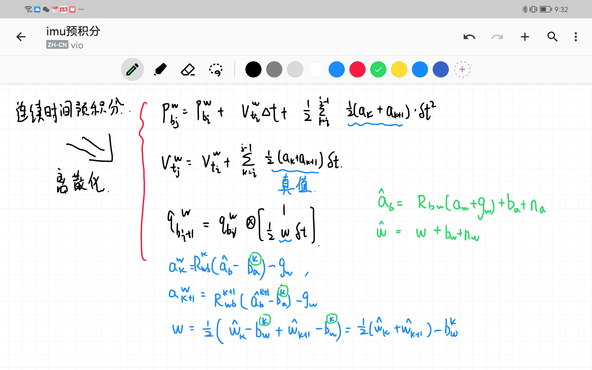

[TOC]

# IMU预积分详细过程

## 一、理论过程

### 1.1 PVQ连续值积分

​	将第 k 帧和第 k+1 帧之间的所有 IMU 进行积分,可得第 k+1 帧的位置、速度和旋转(PVQ),作为视觉估计的初始值,这里的旋转采用的四元数。

​	类比，简单形式：已知加速度，v0，x0和时间间隔，那么可以轻易求出当前时刻速度和位置。
$$
v_1=v_0+a\Delta t\\
x_1=x_0+v_0t+\frac{1}{2}a\Delta t^2
$$
我们得到当前时刻PVQ（连续形式）

手动推导一下：

### 1.2 PVQ离散值积分（中值积分）

#### 1.2.1 理论推导公式

**中值积分：每一个小时刻的采样点的均值 乘 小时间间隔，再进行累加。**

​	由于得到的测量值非连续，因此在计算机处理中必须离散化积分：为了与代码保持一致，我们推导PVQ离散中值积分：

手动推导一下：

#### 1.2.2 对应代码变量

​	从第 i 个 IMU 时刻到第 i+1 个 IMU 时刻的积分过程,这与Estimator::processIMU()函数中的 Ps[j]、Rs[j]和 Vs[j]是一致的(代码中的 j 时刻即为此处的
i+1),IMU 积分出来的第 j 时刻的物理量可以作为第 j 帧图像的初始值。

## 二、代码过程