[TOC]


# IMU预积分详细过程

## 零、整体说明

​	预积分的意义：在优化过程中，**每次迭代都会更新优化变量的值**，比如PVQ，第一次迭代后，**状态变量PVQ会改变**。变化后，**根据公式，我们需要重新求残差，再进行下一次迭代**。而残差是通过积分得来的，可想而知，这非常耗时。

​	因此，**预积分需要将计算残差的过程中的状态变量分离出去**。

#### 分离旋转变量：

​	一开始的积分中是需要当前位姿R的。**我们乘Rbkw（bk帧到世界坐标系的变换）**，就把其中的当前位姿全转化为相对bk帧的位姿了。而这个相对位姿一直由角速度积分得到，是可求的。因此对于PV两个量，IMU预积分值值与不同时刻的a测量值有关。

#### 分离bias：

​	由于bias也是我们的优化变量，但是bias在积分中很难分离出去，因此我们采取**线性化**的方法。**先只考虑上一时刻已知的bias，一直用这个值计算预积分**。**由于真正的bias在迭代中被优化了，这对计算新残差(新预积分量)的过程有影响**，我们不想重新积分，**于是假设新预积分量与bias成线性关系**（f(b+db)=f(b)+Jb*db）。这个bias微小增量定义为：**上一次迭代优化值-上一时刻的状态变量**。这样，每次迭代变化的bias，不积分算残差，用这种方法再更新残差，近似认为是用积分算得的残差。而雅可比矩阵是估计协方差和均值过程中计算的(F)。

​	代码在下面，可以参考。

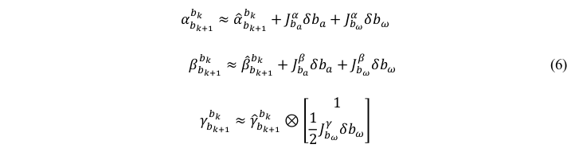	

## 一、理论过程

### 1.1 PVQ连续值积分

​	将第 k 帧和第 k+1 帧之间的所有 IMU 进行积分,可得第 k+1 帧的位置、速度和旋转(PVQ),作为视觉估计的初始值,这里的旋转采用的四元数。

​	类比，简单形式：已知加速度，v0，x0和时间间隔，那么可以轻易求出当前时刻速度和位置。
$$
v_1=v_0+a\Delta t\\
x_1=x_0+v_0t+\frac{1}{2}a\Delta t^2
$$
我们得到当前时刻PVQ（连续形式）

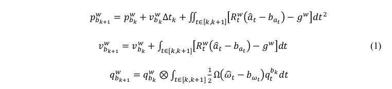

手动推导一下：

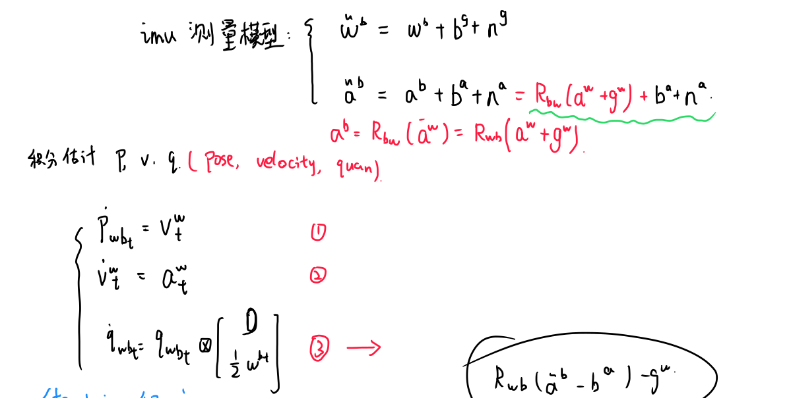


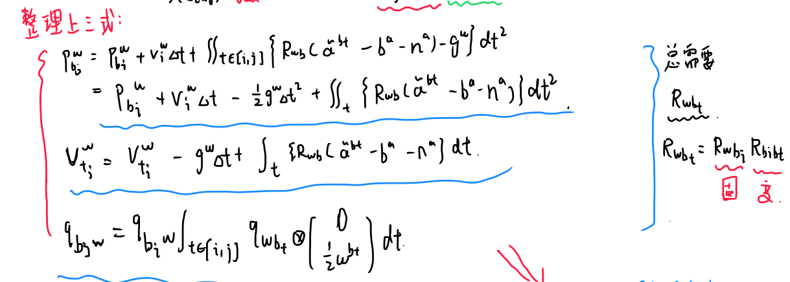

### 1.2 PVQ离散值积分（中值积分）

#### 1.2.1 理论推导公式

**中值积分：每一个小时刻的采样点的均值 乘 小时间间隔，再进行累加。**

​	由于得到的测量值非连续，因此在计算机处理中必须离散化积分：为了与代码保持一致，我们推导PVQ离散中值积分：

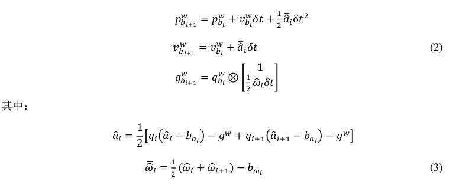

手动推导一下：

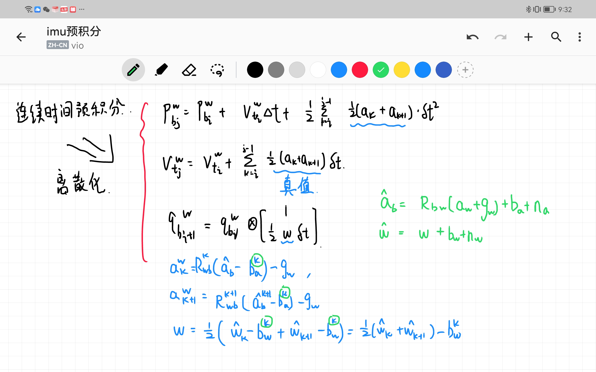

#### 1.2.2 对应代码变量

​	从第 i 个 IMU 时刻到第 i+1 个 IMU 时刻的积分过程,这与Estimator::processIMU()函数中的 Ps[j]、Rs[j]和 Vs[j]是一致的(代码中的 j 时刻即为此处的i+1),IMU 积分出来的第 j 时刻的物理量可以作为第 j 帧图像的初始值。

### 1.3 两帧之间PVQ增量的连续形式(预积分)

​	通过观察公式(1)可知，IMU的预积分需要依赖与第k帧的v和R，当我们在后端进行非线性优化时，需要迭代更新第k帧的v和R，这将导致我们需要根据每次迭代后值重新进行积分，非常浪费时间。因此，我们考虑将优化变量从第k帧到第k+1帧的IMU预积分项中分离开来，通过对公式(1)左右两侧R_w^bk，可以得到

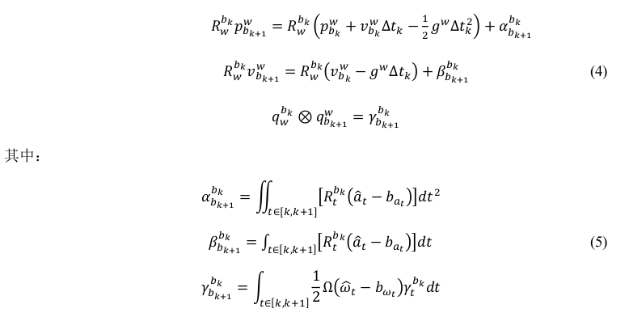

**注意：只把imu预积分里面的R拿出就可以，因为这里采用非线性优化，每次都要迭代，迭代可以获得新的状态变量(R,v...)，得到新的就要重新根据imu数据积分时很麻烦的。因此就把预积分量里面全搞成相对量即可。**

#### 1.3.1 bias的处理

​	这里我们需要重新讨论下公式(5)的预积分公式，其与bias相关，而bias也是需要优化的变量，**每次迭代时，我们得到一个新的bias就要重新积分，非常耗时。**

​	**这里假设预积分的变化量与bias是线性关系，可以写成：**


**这里，得到新的bias后，直接可以根据雅可比矩阵求出新的预积分，之后进行下一次迭代。**

```c++
Eigen::Matrix<double, 15, 1> evaluate(const Eigen::Vector3d &Pi, const Eigen::Quaterniond &Qi, const Eigen::Vector3d &Vi, const Eigen::Vector3d &Bai, const Eigen::Vector3d &Bgi,
                                      const Eigen::Vector3d &Pj, const Eigen::Quaterniond &Qj, const Eigen::Vector3d &Vj, const Eigen::Vector3d &Baj, const Eigen::Vector3d &Bgj)
{
    //Bai与Baj都是优化中迭代出来的bias值
    //delta_p v q都是优化初始值
    Eigen::Matrix<double, 15, 1> residuals;

    Eigen::Matrix3d dp_dba = jacobian.block<3, 3>(O_P, O_BA);
    Eigen::Matrix3d dp_dbg = jacobian.block<3, 3>(O_P, O_BG);

    Eigen::Matrix3d dq_dbg = jacobian.block<3, 3>(O_R, O_BG);

    Eigen::Matrix3d dv_dba = jacobian.block<3, 3>(O_V, O_BA);
    Eigen::Matrix3d dv_dbg = jacobian.block<3, 3>(O_V, O_BG);
	//linearized_ba 优化初始bias值，这里作差就是微小变化量(优化过程中，为了避免积分，不用新的bias去计算预积分，只做修正)
    //修正就认为是用真实迭代出的bias去计算预积分残差了
    //delta_p v q都是优化初始值，所以这里用Bai-bias优化初始值作为bias的增量
    Eigen::Vector3d dba = Bai - linearized_ba;
    Eigen::Vector3d dbg = Bgi - linearized_bg;

    Eigen::Quaterniond corrected_delta_q = delta_q * Utility::deltaQ(dq_dbg * dbg);
    Eigen::Vector3d corrected_delta_v = delta_v + dv_dba * dba + dv_dbg * dbg;
    Eigen::Vector3d corrected_delta_p = delta_p + dp_dba * dba + dp_dbg * dbg;

    residuals.block<3, 1>(O_P, 0) = Qi.inverse() * (0.5 * G * sum_dt * sum_dt + Pj - Pi - Vi * sum_dt) - corrected_delta_p;
    residuals.block<3, 1>(O_R, 0) = 2 * (corrected_delta_q.inverse() * (Qi.inverse() * Qj)).vec();
    residuals.block<3, 1>(O_V, 0) = Qi.inverse() * (G * sum_dt + Vj - Vi) - corrected_delta_v;
    residuals.block<3, 1>(O_BA, 0) = Baj - Bai;//bias残差
    residuals.block<3, 1>(O_BG, 0) = Bgj - Bgi;
    return residuals;
}
```

### 1.4 两帧之间PVQ增量(预积分)的离散形式

中值法，i时刻测量和i+1时刻测量已知，求预积分：

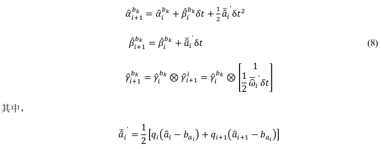

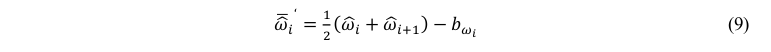

​	这与 Estimator::processIMU()函数中的 IntegrationBase::push_back()上是一致的。**注意这里跟公式(2)是不一样的,这里积分出来的是前后两帧之间的 IMU 增量信息,而公式(2)给出的当前帧时刻的物理量信息。**

```c++
Vector3d un_acc_0 = delta_q * (_acc_0 - linearized_ba);
Vector3d un_gyr = 0.5 * (_gyr_0 + _gyr_1) - linearized_bg;
result_delta_q = delta_q * Quaterniond(1, un_gyr(0) * _dt / 2, un_gyr(1) * _dt / 2, un_gyr(2) * _dt / 2);
Vector3d un_acc_1 = result_delta_q * (_acc_1 - linearized_ba);
Vector3d un_acc = 0.5 * (un_acc_0 + un_acc_1);
result_delta_p = delta_p + delta_v * _dt + 0.5 * un_acc * _dt * _dt;
result_delta_v = delta_v + un_acc * _dt;
result_linearized_ba = linearized_ba;
result_linearized_bg = linearized_bg;         
```

### 1.5 一些说明

​	PVQ积分，是通过IMU的测量值，积分出当前PVQ。举个简单例子：二维环境，质点加速度已知，初速度以及初始位置已知，那么质点每时刻的速度位置都可以通过积分计算得来：
$$
x=x_0+v_0t+\frac{1}{2}at^2\\
v=v_0+at\\
x=x_0+\int vdt=x_0+\int_{t\in[i,j]}v_0dt+\int\int adt^2=x_0+v_0t+\alpha\\
v=v_0+\int_{t\in[i,j]} adt=v_0+\beta
$$
​	我们可以看出，上式子中的alpha和beta就是积分量，这个积分量可以认为是增量，也是通过IMU测量得出的。我们简单描述为：


**为了方便积分，程序中不直接通过IMU测量值直接估计机器人当前PVQ位姿，而是对一段时间内的测量值预积分PVQ增量，再估计得到机器人当前PVQ位姿。**

​	再类比一下，两帧间相对位姿可以类比为PVQ增量；绝对位姿类比为机器人当前PVQ位姿。

​	对1.6章节的说明：**由于IMU单次测量存在误差，那么积分出的量也有误差。同理，协方差也有。协方差表示了这段测量量的相关程度(可信度)**。由于当前状态总与上一时刻状态相关(上一时刻+增量)，那么我们就需要预测其均值与协方差。

​	*补充：通过一组数据计算出方差和均值，则可代表这个随机变量。*

### 1.6 连续形式下PVQ增量的误差、协方差以及Jacobian

​	**IMU在每一个时刻积分出来的值是有误差的**，因此我们需要对误差进行分析，在t时刻误差项的导数为：（这里的delta表示两帧间时间段的预积分量）

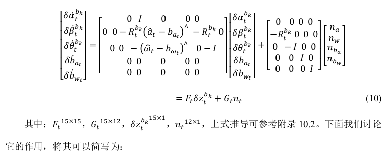
$$
\delta \dot z_t^{bk}=F_t\delta z_t^{b_k}+G_tn_t
$$
对时间t求导，随时间的变量有每个状态变量和每个时刻的误差。**我们现在计算第t+deltat时刻的预积分量与t时刻预积分量的关系：**

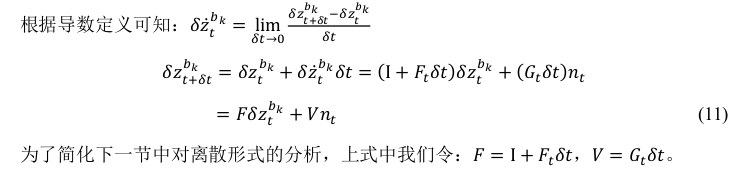

**上式给出了如EKF一样对非线性系统线性化的过程，意义：表示下一时刻的IMU测量误差与上一个时刻的成线性关系。这样，我们可以根据当前的值预测出下一个时刻的均值和协方差。**

​	公式(11)表示均值预测，协方差预测公式如下：


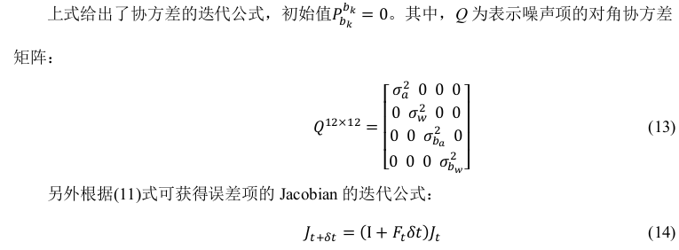

式(14)理解：？？？？？？？？？？？？？？？？？？？？？？？？？？？？

*和卡尔曼滤波中的状态量的预测方程很类似*

### 1.7 离散形式的PVQ增量误差分析

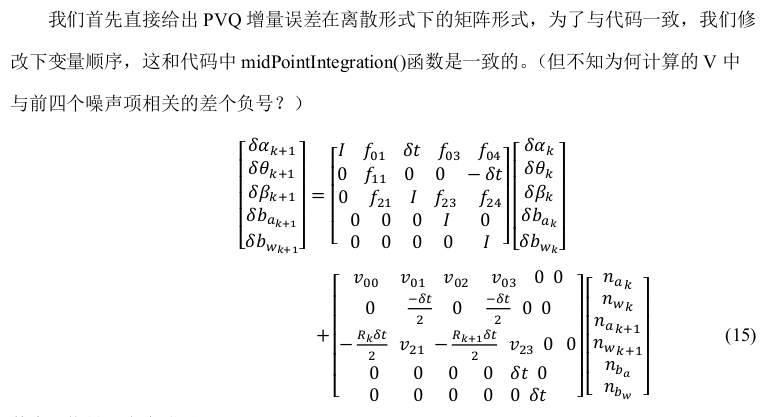

推导：？？？？？？？？？？？？？？？？？？？？？？？？？

对应代码：

```c++
Vector3d w_x = 0.5 * (_gyr_0 + _gyr_1) - linearized_bg;
Vector3d a_0_x = _acc_0 - linearized_ba;
Vector3d a_1_x = _acc_1 - linearized_ba;
Matrix3d R_w_x, R_a_0_x, R_a_1_x;

R_w_x<<0, -w_x(2), w_x(1),
w_x(2), 0, -w_x(0),
-w_x(1), w_x(0), 0;
R_a_0_x<<0, -a_0_x(2), a_0_x(1),
a_0_x(2), 0, -a_0_x(0),
-a_0_x(1), a_0_x(0), 0;
R_a_1_x<<0, -a_1_x(2), a_1_x(1),
a_1_x(2), 0, -a_1_x(0),
-a_1_x(1), a_1_x(0), 0;

MatrixXd F = MatrixXd::Zero(15, 15);
F.block<3, 3>(0, 0) = Matrix3d::Identity();
F.block<3, 3>(0, 3) = -0.25 * delta_q.toRotationMatrix() * R_a_0_x * _dt * _dt + 
    -0.25 * result_delta_q.toRotationMatrix() * R_a_1_x * (Matrix3d::Identity() - R_w_x * _dt) * _dt * _dt;
F.block<3, 3>(0, 6) = MatrixXd::Identity(3,3) * _dt;
F.block<3, 3>(0, 9) = -0.25 * (delta_q.toRotationMatrix() + result_delta_q.toRotationMatrix()) * _dt * _dt;
F.block<3, 3>(0, 12) = -0.25 * result_delta_q.toRotationMatrix() * R_a_1_x * _dt * _dt * -_dt;
F.block<3, 3>(3, 3) = Matrix3d::Identity() - R_w_x * _dt;
F.block<3, 3>(3, 12) = -1.0 * MatrixXd::Identity(3,3) * _dt;
F.block<3, 3>(6, 3) = -0.5 * delta_q.toRotationMatrix() * R_a_0_x * _dt + 
    -0.5 * result_delta_q.toRotationMatrix() * R_a_1_x * (Matrix3d::Identity() - R_w_x * _dt) * _dt;
F.block<3, 3>(6, 6) = Matrix3d::Identity();
F.block<3, 3>(6, 9) = -0.5 * (delta_q.toRotationMatrix() + result_delta_q.toRotationMatrix()) * _dt;
F.block<3, 3>(6, 12) = -0.5 * result_delta_q.toRotationMatrix() * R_a_1_x * _dt * -_dt;
F.block<3, 3>(9, 9) = Matrix3d::Identity();
F.block<3, 3>(12, 12) = Matrix3d::Identity();
//cout<<"A"<<endl<<A<<endl;

MatrixXd V = MatrixXd::Zero(15,18);
V.block<3, 3>(0, 0) =  0.25 * delta_q.toRotationMatrix() * _dt * _dt;
V.block<3, 3>(0, 3) =  0.25 * -result_delta_q.toRotationMatrix() * R_a_1_x  * _dt * _dt * 0.5 * _dt;
V.block<3, 3>(0, 6) =  0.25 * result_delta_q.toRotationMatrix() * _dt * _dt;
V.block<3, 3>(0, 9) =  V.block<3, 3>(0, 3);
V.block<3, 3>(3, 3) =  0.5 * MatrixXd::Identity(3,3) * _dt;
V.block<3, 3>(3, 9) =  0.5 * MatrixXd::Identity(3,3) * _dt;
V.block<3, 3>(6, 0) =  0.5 * delta_q.toRotationMatrix() * _dt;
V.block<3, 3>(6, 3) =  0.5 * -result_delta_q.toRotationMatrix() * R_a_1_x  * _dt * 0.5 * _dt;
V.block<3, 3>(6, 6) =  0.5 * result_delta_q.toRotationMatrix() * _dt;
V.block<3, 3>(6, 9) =  V.block<3, 3>(6, 3);
V.block<3, 3>(9, 12) = MatrixXd::Identity(3,3) * _dt;
V.block<3, 3>(12, 15) = MatrixXd::Identity(3,3) * _dt;

//step_jacobian = F;
//step_V = V;
jacobian = F * jacobian;
covariance = F * covariance * F.transpose() + V * noise * V.transpose();
```


### 1.8 离散形式的PVQ增量误差的Jacobian和协方差

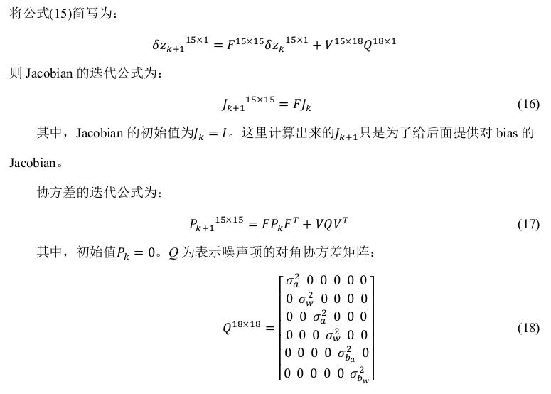

推导：？？？？？？？？？？？？？？？？？

## 二、代码过程


