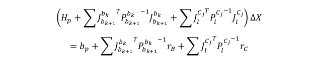
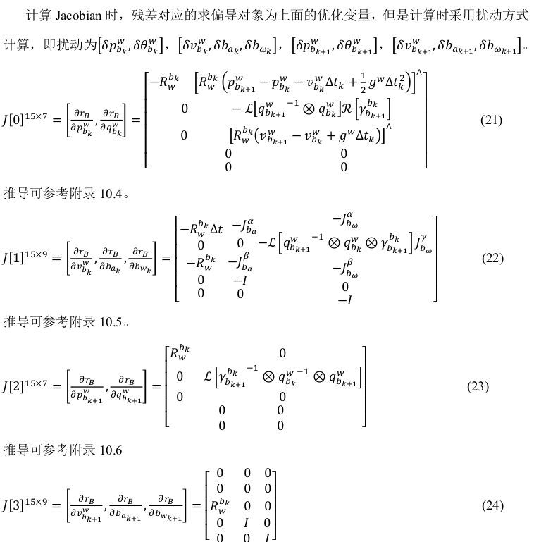

[TOC]


# 非线性优化

## 1.1 状态向量

​	状态向量包括滑动窗口内的n+1个状态：**位姿、速度、ba、bw、Camera->IMU外参、m+1个3D点的逆深度**。


## 1.2 目标函数

### 1.2.1 目标函数具体形式


​	其中，三个残差项分别为：**边缘化的先验信息、IMU测量残差、视觉重投影残差。**三种残差都是马氏距离表示。

### 1.2.2 以GN法为例求解该非线性优化问题

​	以IMU残差为例，可写成如下所示：


其中，**J为误差项rB关于所有状态向量(优化变量)X的雅可比**，将上式展开并令关于deltaX的导数为0，可得增量deltaX的计算公式：（GN法）


那么，对公式(19)的整体目标函数的整体增量方程可写成：



**其中，Pbk为IMU预积分噪声协方差，PlCj为视觉重投影噪声协方差。当IMU噪声协方差Pbk越大时，其信息矩阵越小，意味着IMU观测越不可信。**

*注意，这里的IMU和visual协方差的绝对值没有意义，要考虑两者的相对性。*

​	将上式继续化简：


注意：求雅可比时，我们通常采取扰动方式：


### 1.2.3 小结

​	我们根据1.2.2章节中的内容可以知道，先不考虑边缘化的先验信息，我们每次迭代需要求解的是：**残差、雅可比以及更新协方差**。因此，后面内容围绕这几个关键量进行讲解。

## 1.3 IMU约束

### 1.3.1 IMU残差

两帧之间的PVQ和bias的变化量的差：


代码中IntergrationBase::evaluate()对应。

```c++
Eigen::Matrix<double, 15, 1> evaluate(const Eigen::Vector3d &Pi, const Eigen::Quaterniond &Qi, const Eigen::Vector3d &Vi, const Eigen::Vector3d &Bai, const Eigen::Vector3d &Bgi,
                                      const Eigen::Vector3d &Pj, const Eigen::Quaterniond &Qj, const Eigen::Vector3d &Vj, const Eigen::Vector3d &Baj, const Eigen::Vector3d &Bgj)
{
    Eigen::Matrix<double, 15, 1> residuals;

    Eigen::Matrix3d dp_dba = jacobian.block<3, 3>(O_P, O_BA);
    Eigen::Matrix3d dp_dbg = jacobian.block<3, 3>(O_P, O_BG);

    Eigen::Matrix3d dq_dbg = jacobian.block<3, 3>(O_R, O_BG);

    Eigen::Matrix3d dv_dba = jacobian.block<3, 3>(O_V, O_BA);
    Eigen::Matrix3d dv_dbg = jacobian.block<3, 3>(O_V, O_BG);

    Eigen::Vector3d dba = Bai - linearized_ba;
    Eigen::Vector3d dbg = Bgi - linearized_bg;

    Eigen::Quaterniond corrected_delta_q = delta_q * Utility::deltaQ(dq_dbg * dbg);
    Eigen::Vector3d corrected_delta_v = delta_v + dv_dba * dba + dv_dbg * dbg;
    Eigen::Vector3d corrected_delta_p = delta_p + dp_dba * dba + dp_dbg * dbg;

    residuals.block<3, 1>(O_P, 0) = Qi.inverse() * (0.5 * G * sum_dt * sum_dt + Pj - Pi - Vi * sum_dt) - corrected_delta_p;
    residuals.block<3, 1>(O_R, 0) = 2 * (corrected_delta_q.inverse() * (Qi.inverse() * Qj)).vec();
    residuals.block<3, 1>(O_V, 0) = Qi.inverse() * (G * sum_dt + Vj - Vi) - corrected_delta_v;
    residuals.block<3, 1>(O_BA, 0) = Baj - Bai;
    residuals.block<3, 1>(O_BG, 0) = Bgj - Bgi;
    return residuals;
}
```

其中，有关bias的更新，见`一、IMU预积分.md`

### 1.3.2 优化变量

body(imu)位姿、速度、加速度计陀螺仪bias


### 1.3.3 Jacobian

*注意这里的雅可比和误差的雅可比不一样。这里的雅可比是残差对状态量的求导，误差的雅可比是误差对时间的雅可比(预测方程)。*

​	我们先给出雅可比的结果：



​	上面公式在代码中对应:class IMUFactor : public ceres::SizedCostFunction<15, 7, 9, 7, 9>对于 Evaluate 输入 double const *const *parameters, parameters[0],parameters[1],parameters[2],parameters[3]分别对应 4 个输入参数, 它们的长度依次是 7,9,7,9,分别对应 4 个优化变量的参数块。

​	代码 IMUFactor::Evaluate()中 residual 还乘以一个信息矩阵 sqrt_info,这是因为真正的优化项其实是 Mahalanobis 距离:d = r ^T P -1 r,P 是协方差,又因为 Ceres 只接受最小二乘优化,也就是min(e^Te), 所以把P-1 做 LLT 分解,即LL ^T = P -1, 则有:
$$
d=r^TLL^Tr=(L^Tr)^T(L^Tr)
$$
这样，令r'=L^Tr得到新的优化误差，就可以用Ceres求解了。

**手动推导：**？？？？？？？？？？？？？？？？？？？？？？？？？？？？？？？？？

### 1.3.4 协方差

​	根据公式(17)，即


可以更新协方差。

**协方差是测量误差的协方差，可以判定本次测量的可信度。**

## 1.4 视觉约束

​	*可以理解为重投影误差*

### 1.4.1 视觉残差

​	对于第l个路标点P，将P从第一次看到它的第i个相机坐标系，转换到当前第j个相机坐标系下的像素坐标，可以定义视觉误差为：


其中，式子27，理解为：**frame i 下的点P，转换到body(imu)坐标系下，body再转到world，world转到body j，body j再转到frame j下(camera)。**

### 1.4.2 优化变量

相机位姿、camera imu外参、逆深度。


### 1.4.3 Jacobian

对上述优化变量进行求导，先给出结论：


手动推导：

### 1.4.4 协方差

​	


