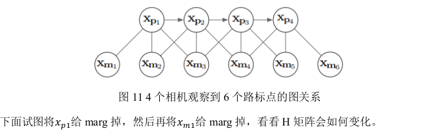

[TOC]


# 边缘化Marginalization和FEJ

## 1、边缘化和Schur(舒尔补)公式

### 1.1 边缘化的概念以及意义

​	为了减少滑动窗口中需要优化的变量数量，采取边缘化的方式，去掉不想继续优化的量。

Hx=b可以写成如下形式：


上式中，xa、xb并非一定为相机位姿部分和路标部分，而是希望marg的部分和希望保留的部分。

​	**假设，上式xa是我们要marg的变量，比如一个相机的pose。因此，我们更关心如何只求解我们希望保留的变量xb，不管xa。但是，又不能直接将xa与其相关的路标点等信息直接删掉，因为这样会减少约束，丢失信息。**

​	采取Schur消元：


### 1.2 Schur公式

*详见：VIO笔记markdown第三节：滑动窗口*

### 1.3 例子

​	下面，我们用一个具体例子来形象说明边缘化过程及其导致的矩阵稠密现象(fill-in)。假设有四个相机位姿xpi，以及六个路标点xmk(路标点用xyz参数化)，相机与路标点的边表示一次观测，相邻相机之间的边表示IMU约束，相互关系如下：




​	我们对上图进行详细说明：

#### Step0: 复习矩阵中块的含义

​	首先，矩阵中有填充的部分表示，状态变量m与n相关。拿图13举例：**m1和p1是有关的，观测误差e11中，对m1求导和对p1求导不为零。即p1帧中，观测到了m1路标点。**以此类推，p2中观测到m1,m2,m3，同时p2还与p1、p3有关。因此，这个大矩阵，设为H，**非零块代表了某两个状态量是存在约束的(约束的含义理解为，有一个误差项包含了这两个状态变量)。**

​	*对最后一句话再解释一下：*重投影误差e11：
$$
e_{11}=u-KT_1P_{w_1}
$$
对路标点Pw1求导非零，对位姿T1的李代数求导非零。这就表示，这两个状态量间存在了一个约束。

#### Step1 a->b:

​	(a)->(b)，先找到要边缘化的变量，将其对应的矩阵块移动到左上角，得出：Λa和Λb。之后再求Λc-Λb^TΛa-1Λb。详细如下图所示：


#### Step2 b->c:

​	计算新的矩阵Λc-Λb^TΛa-1Λb，有一部分矩阵会变得稠密：


**稠密图：**


#### Step3: c->d


可以看出，c->d这个过程，marg了xm1，但是xm1只和xp1有关，因此H矩阵没有变稠密，**因此，如果marg掉那些不被其他帧观测到的路标点，不会使得H矩阵变得稠密。而要marg掉的路标点中，对于那些被其他帧观测到的路标点，可以考虑直接丢弃。**

## 2、VINS两种边缘化策略

代码中有一些变量需要提前说明：

```c++

ceres::CostFunction *cost_function;
ceres::LossFunction *loss_function;
//优化变量数据
std::vector<double *> parameter_blocks;
//等待marg的优化变量id
std::vector<int> drop_set;

//Jacobian
double **raw_jacobians;
std::vector<Eigen::Matrix<double, Eigen::Dynamic, Eigen::Dynamic, Eigen::RowMajor>> jacobians;
//残差，IMU：15x1 ， 视觉2x1
Eigen::VectorXd residuals;
```


```c++
class MarginalizationInfo
{
  public:
    MarginalizationInfo(){valid = true;};
    ~MarginalizationInfo();
    int localSize(int size) const;
    int globalSize(int size) const;
    void addResidualBlockInfo(ResidualBlockInfo *residual_block_info);
    void preMarginalize();
    void marginalize();
    std::vector<double *> getParameterBlocks(std::unordered_map<long, double *> &addr_shift);
	//所有观测项
    std::vector<ResidualBlockInfo *> factors;
    //m为要marg的变量个数，也就是parameter_block_idx的总localSize,以double为单位,VBias为9,PQ为6
    //n为要保留下的优化变量的变量个数,n=localSize(parameter_block_size) – m
    int m, n;
    //优化变量内存地址
    std::unordered_map<long, int> parameter_block_size; //global size
    int sum_block_size;
    //<待marg的优化变量内存地址,在
	//parameter_block_size中的id,以double为单位>
    std::unordered_map<long, int> parameter_block_idx; //local size
    //<优化变量内存地址,数据>
    std::unordered_map<long, double *> parameter_block_data;

    std::vector<int> keep_block_size; //global size
    std::vector<int> keep_block_idx;  //local size
    std::vector<double *> keep_block_data;

    Eigen::MatrixXd linearized_jacobians;
    Eigen::VectorXd linearized_residuals;
    const double eps = 1e-8;
    bool valid;

};
```

这里再结合所有代码理解一下？？？？？？？？？？？？？？？？？？？？？？？？？？？？

### 2.1 边缘化最老的帧


**当次新帧为关键帧时，将最老帧marg掉，同时marg掉其看到的路标点和相关联的IMU数据，将其转化为先验信息加到整体目标函数中。**

这里再结合所有代码理解一下？？？？？？？？？？？？？？？？？？？？？？？？？？？？

### 2.2 边缘化先前的一帧

​	**当次新帧不是关键帧时,MARGIN_SECOND_NEW,我们将直接扔掉次新帧及它的视觉观测边,而不对次新帧进行 marg,因为我们认为当前帧和次新帧很相似,也就是说当前帧跟路标点之间的约束和次新帧与路标点的约束很接近,直接丢弃并不会造成整个约束关系丢失过多信息**。但是值得注意的是,我们要保留次新帧的 IMU 数据,从而保证 IMU 预积分的连贯性。
​	通过以上过程先验项就构造完成了,在对滑动窗口内的状态量进行优化时,把它与 IMU残差项和视觉残差项放在一起优化,从而得到不丢失历史信息的最新状态估计的结果。

## 3、First Estimate Jacobian(FEJ)


