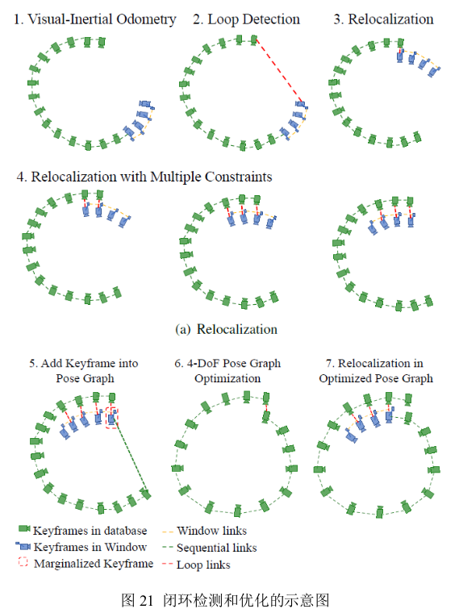
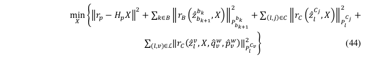
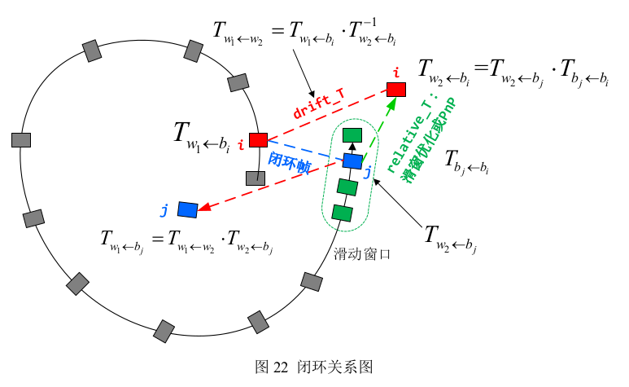
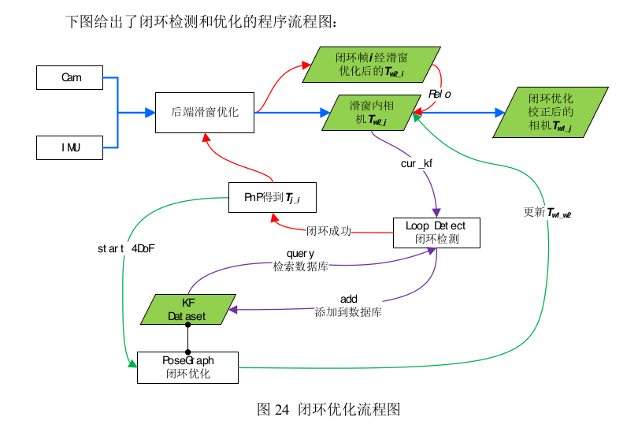

[TOC]

# 六、闭环检测和优化

## 6.1 闭环检测概述

​	VINS是采用BRIEF描述子的DBoW2词袋进行闭环检测。前端识别的Harris角点数量通常只有70个，对闭环检测来讲太少了。**因此，对新来的关键帧，再检测出500个FAST角点进行闭环检测，同时提取BRIEF描述子。**然后，将KF添加到数据库中，**计算当前帧词袋的相似度分数，与KF数据库中所有帧进行对比，同时检测闭环一致性，获得闭环候选帧**。

​	*只对关键帧提取很多FAST角点以及BREIF描述子，大大增加了程序效率。*

​	当检测到闭环后，**在函数findConnection函数中进行PnP求解相对位姿**。首先利用BRIEF描述子对**闭环对**中老帧的500个FAST角点，和当前帧中70个Harris角点进行基于描述子的邻域匹配(searchByBREIF)：当匹配点数大于阈值后，将匹配点对利用PnPRANSAC剔除异常点，获得相对位姿。当剔除后的匹配点仍超过阈值时,我们最终认为该候选帧是一个正确的闭环帧,并将闭环帧 push 到 optimize_buf中。

## 6.2 快速重定位

​	检测到闭环时 (当前帧与第v帧)，若开启快速重定位，即FAST_RELOCALIZATION = true时，**会将第v帧的位姿和相关特征点作为视觉约束项，加到后端非线性优化的整体目标函数中，用滑窗优化来更精确地计算第v帧的位姿**，从而计算出闭环帧之间的相对位姿关系：

​	这样，我们根据优化得到的相对位姿关系，对滑窗内所有帧进行调整，完成快速重定位。

## 6.3 闭环关键帧数据库

## 6.4 闭环优化

​	位姿图优化。

## 6.5 程序(闭环检测)逻辑

### 6.5.1 闭环检测更新逻辑

- ij为闭环帧，其相对位姿可以计算出来，为绿色，这是真实的。
- j当前位姿是非真实的(漂移、误差等因素导致)
- 我们认为第i帧位姿是真实的
- 这样，根据图中所示关系，可以求出第j帧的真实位姿
- 再根据第j帧，调整滑动窗口中其他帧的位姿

这里与ORB-SLAM2中的回环检测逻辑非常类似，详见`ORB-SLAM2代码阅读笔记————LoopClosing.md`

### 6.5.2 闭环检测和优化的程序流程图：

​	上图中，**蓝线为正常的闭环优化流程**，即通过后端的非线性优化来更新滑窗内所有相机的位姿。**紫线为闭环检测模块**，当后端优化完成后,会将滑窗内的次新帧进行闭环检测,即首先提取新角点并进行描述，然后与数据库进行检索，寻找闭环帧，并将该帧添加到数据库中。**红线为快速重定位模块**，当检测到闭环帧后，会将闭环约束添加到后端的整体目标函数中进行非线性优化，得到第 i 帧(注意这里的帧为闭环帧中的老帧)经过滑窗优化后的位姿，**从而计算出累积的偏移误差**，进而对滑窗内的位姿进行修正。

