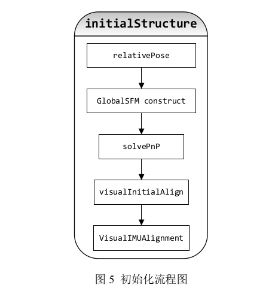
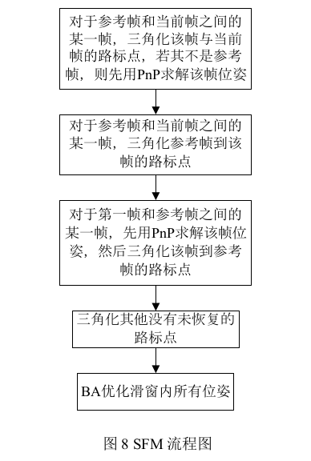
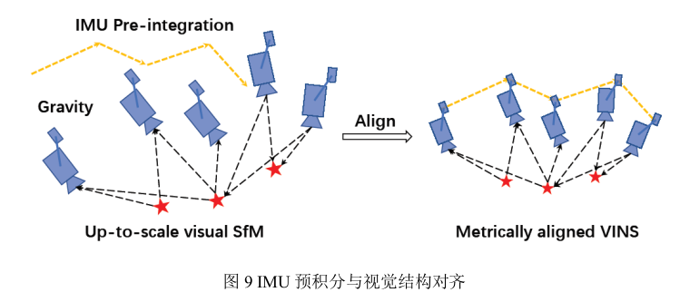
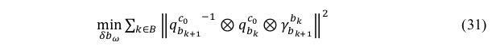
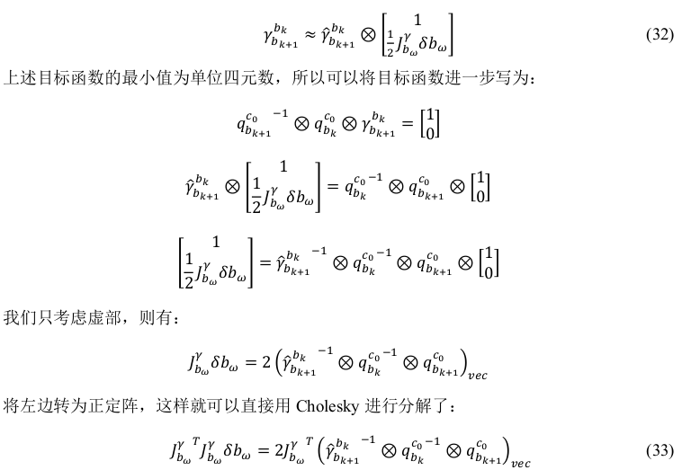
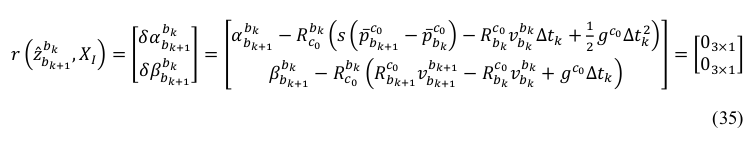
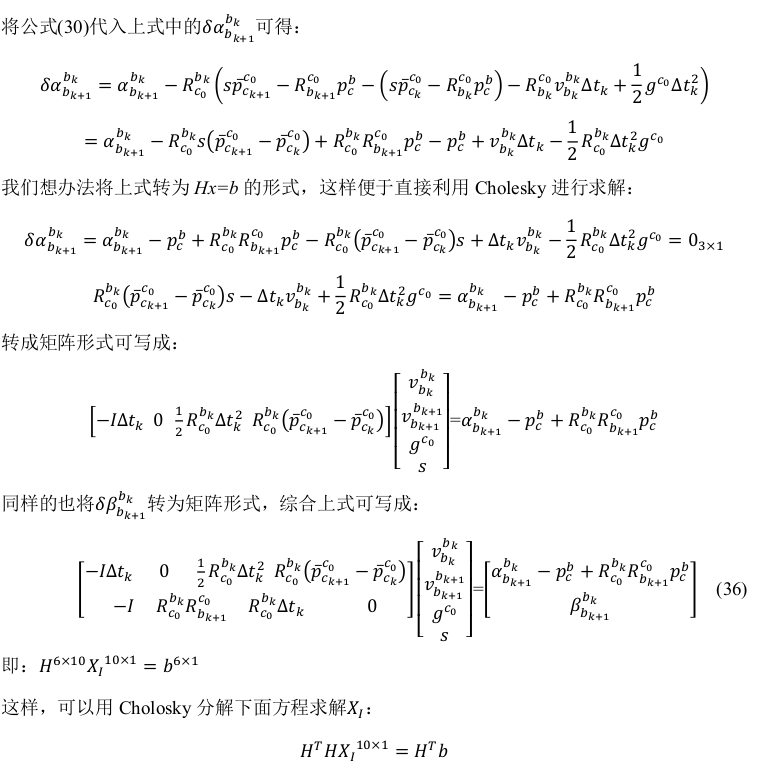
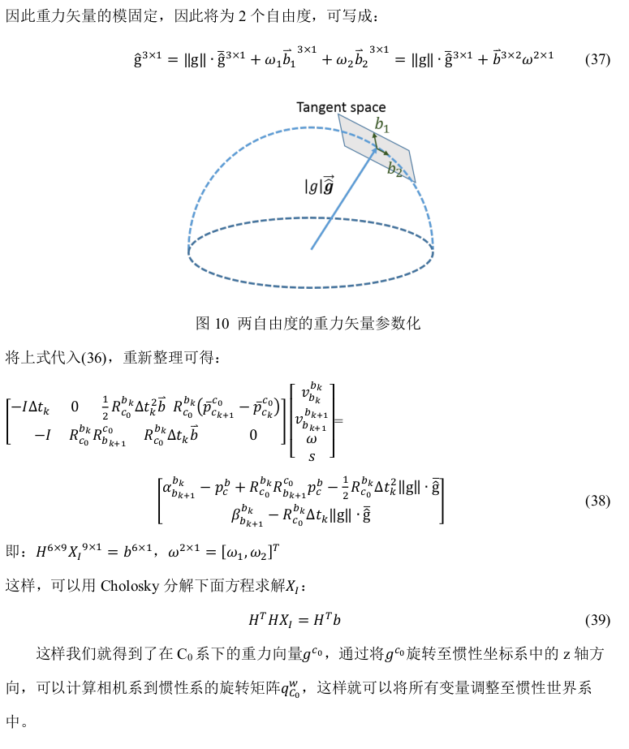

[TOC]

# 四、VINS初始化

## 1、SLAM中的松耦合紧耦合

​	VIO中，松耦合与紧耦合的区别在于是否将视觉特征点加入状态变量。一般情况，松耦合一般基于卡尔曼滤波；紧耦合大多是非线性优化(Ceres、g2o库)。

## 2、VINS初始化概述

### 2.1 初始化目的

​	计算出尺度信息、初始bias信息、重力加速度信息。纯视觉主要计算尺度信息，VIO都要计算。

### 2.2 初始化方案

​	**初始化采用视觉和IMU的松耦合方案**，首先用SFM求解滑窗内所有帧的位姿，以及所有路标点的3D位置，然后与IMU预积分的值对齐，进而求解重力方向、尺度因子、bias以及每一帧对应的速度。

流程图如下：

## 3、初始化步骤

### 3.1 relativePose

​	**根据论文部分，首先进行纯视觉初始化**：检查最新帧和所有先前帧之间的特征对应关系。 如果能在滑动窗口中找到最新帧与任何其他帧之间的稳定特征跟踪（超过 30 个跟踪的特征）和足够的视差（超过 20 个像素），**则进行5点法计算相对位姿**。之后任意设定尺度进行三角化，得到3D特征点进行PnP计算滑窗内其他帧的位姿。

​	在滑窗内寻找与当前帧的匹配特征点数较多的关键帧作为**参考帧**，并通过求解基础矩阵计算出当前帧到参考帧的T。

### 3.2 GlobalSFM construct

*主要目的是重建3D特征点*

​	简单来讲，有了参考帧之后，把其他帧相对于参考帧的位姿求解出来，之后三角化其中的特征点，再进行全局BA。把第一帧规定为世界坐标系。

### 3.3 solve PnP

*主要目的求解位姿*

​	对滑窗内每一帧图像,都跟上一步 SFM 得到的所有 3D 路标点,进行 cv::solvePnP 求解位姿。纯视觉初始化时,我们采用第一帧 c 0 作为基准坐标系,若要转化为从 body 坐标系到 c 0 坐标系,可以进行如下变换:
$$
T_{c_0b_k}=T_{c_0c_k}T_{c_kb_k}\\
c_k到c_0的变换由PnP求得，k帧body->camera就是T_{cb}
$$

### 3.4 visualInitialAlign

​	现在进行视觉惯性对齐，比较复杂。目的是：

- 第一在**进行陀螺仪偏置初始化的时候要同时使用到IMU测量的旋转和视觉测量的旋转，也就是要联合视觉和惯性的数据。**
- 第二这里求得的尺度S的值不仅仅是IMU的，**还是视觉和IMU整个系统的尺度。（IMU尺度真实）**。

#### 3.4.1 陀螺仪bias校正

*对应代码再solveGyroscopeBias()函数*

理论：**visual给出的相邻帧间的旋转应该等于IMU预积分的旋转值**。
$$
R_{c_0c_k}=R_{b_0b_k}\\
R_{b_kb_{k+1}}=R_{c_kc_{k+1}}=R_{b_kc_0}R_{c_0b_{k+1}}\\
R_{b_kc_0},R_{c_0b_{k+1}}通过全局BA已经算出来了\\
IMU给出的预积分：\gamma^{b_k}_{b_{k+1}}
$$

目标函数：

其中：

求解出陀螺仪的bias后，需要对IMU预积分值进行重新计算。

**上述公式手动推导一下：？？？？？？？？？？？？？？？？？？？？？？？？？？？？？**

#### 3.4.2 初始化速度、重力和尺度因子

*对应代码LinearAlignment()函数*

**优化变量：**
$$
X_l^{3(n+1)+3+1}=[v_{b_0},...,v_{b_n},g^{c_0},s]
$$
其中,gc0 为在第 0 帧 Camera 相机坐标系下的重力向量。

**残差定义为：IMU预积分出的增量与视觉预测值之间的误差：**

$$
\alpha为位移增量,\beta为速度增量
$$

**上部分需要手动推导：？？？？？？？？？？？？？？？？？？？？？？？？？？？？？？？？？？**

#### 3.4.3 修正重力矢量

*对应代码RefineGravity()*

**上部分需要手动推导：？？？？？？？？？？？？？？？？？？？？？？？？？？？？？？？？？？**

