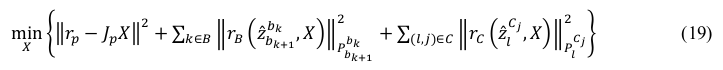

[TOC]

# 非线性优化

## 1.1 状态向量

​	状态向量包括滑动窗口内的n+1个状态：**位姿、速度、ba、bw、Camera->IMU外参、m+1个3D点的逆深度**。

## 1.2 目标函数

### 1.2.1 目标函数具体形式

​	其中，三个残差项分别为：**边缘化的先验信息、IMU测量残差、视觉重投影残差。**三种残差都是马氏距离表示。

### 1.2.2 以GN法为例求解该非线性优化问题

## 1.3 IMU约束

### 1.3.1 IMU残差

### 1.3.2 优化变量

### 1.3.3 Jacobian

### 1.3.4 协方差

## 1.4 视觉约束

### 1.4.1 视觉残差

### 1.4.2 优化变量

### 1.4.3 Jacobian

### 1.4.4 协方差

