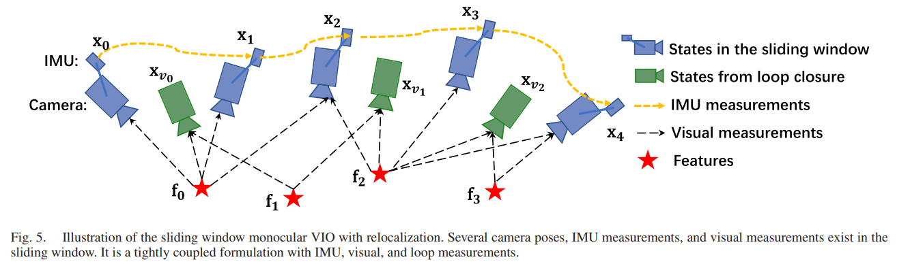
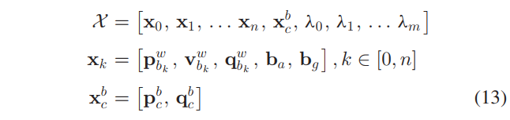
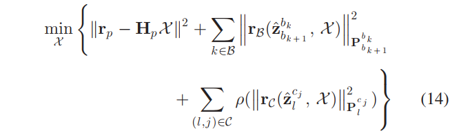
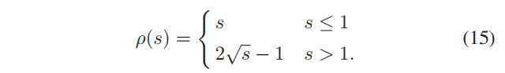
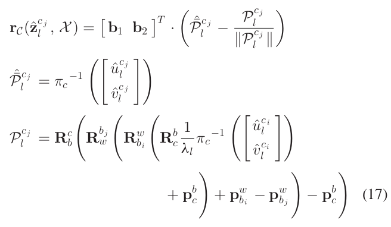
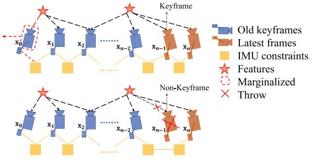

# VINS-Mono: A Robust...

## Abstract

​	一个相机和一个低耗IMU组成了VINS(visual-inertial system)，它是度量六自由度状态估计的最小传感器套件（尺寸、重量和功率）。

​	我们提出VINS。我们的方法首先开始于一个稳定的初始化过程。**一个紧耦合的，通过融合IMU信息以及特征点观测信息，基于非线性优化的方法用来获取高精度视觉惯性里程计信息。**

​	回环检测模块，可以在最小计算量下实现重定位。**我们还提供四自由度的位姿优化来增强全局一致性。**

​	此外，所提出的系统可以通过以有效的方式保存和加载地图来重用地图。当前地图和先前地图可以通过全局位姿优化融合。

## I. Introduction

| Words                  | Translation       |
| ---------------------- | ----------------- |
| application            | n.应用            |
| rigorous               | adj.严格的        |
| stationary             | adj.静止的        |
| eliminate              | v.消除            |
| bootstrap              | v.引导 n.引导程序 |
| propagation            | n.传播            |
| marginalize            | v.边缘化          |
| optimal state estimate | 最佳状态估计      |
| residual models        | 残差模型          |
| displacement           | n.位移            |
| photometric error      | n.光度误差        |
| convergence            | v.收敛            |
|                        |                   |
|                        |                   |
|                        |                   |
|                        |                   |
|                        |                   |

​	状态估计无疑是机器人操作的最重要部分，例如导航、自动驾驶、VR、AR(增强现实)。单目相机由于其规模小、低耗而被重视。但是单目无法恢复尺度信息，这是其限制应用的地方。

​	现在，IMU+相机非常流行。VINS主要优点可以观测到尺度信息(metric scale)和俯仰角及翻滚角。

​	此外，对IMU测量值积分可以有效地提高跟踪表现，其弥补相机在光照、低纹理、动态模糊情况下的不足。**VINS可以应用于无人车或者无人机以及移动端设备。**

​	**但是，有几个问题影响单目VINS的使用：**

​	首先为严格的初始化。由于缺少距离信息，很难直接融合单目视觉信息和IMU信息。**大多数情况，系统应在一个已知静止条件下启动，且启动过程应缓慢小心。**

​	第二个问题为VIO不可避免的漂移问题。**为了尽可能消除误差，回环检测、重定位以及全局优化需要考虑。**

​	除了上述致命问题，地图保存和再利用的需求正在增长 。

​	VINS-Mono包括下列特点

1. 鲁棒的初始化过程，可以引导系统从未知的初始状态进行初始化
2. 紧耦合的基于优化的单目VIO
3. 实时重定位和四自由度位姿图优化
4. 位姿图重用且支持保存、读取及融合多局部位姿图

论文结构：Section III 系统整体概况；Section IV IMU预积分；Section V 初始化 ； Section VI 紧耦合的、可自动校准的、基于非线性优化的单目视觉惯性里程计；Section VII 紧耦合的重定位(回环) ； Section VIII 全局位姿优化。

## II. Related Work

​	最简单的视觉惯导就是**松耦合**[9],[10]，其中IMU被当作独立的模块辅助视觉。**融合方式通常为扩展卡尔曼滤波(EKF)**，其中IMU被用作状态传播(state propagation)。**基于EKF和图优化的VI算法出现，其中对相机和IMU测量值联合优化(jointly optimized)。**

​	优秀的基于EKF的VIO方法是MSCKF[11]。*MSCKF 在状态向量中维护几个先前的相机位姿，并使用跨多个相机视图的相同特征的视觉测量来形成多约束更新*？？？？？？。**可以进一步理解MSCKF**

​	SR-ISWF[20],[21]为MSCKF的扩展。

​	为了达到常数处理时间，基于图优化的VIO方法采取滑窗来边缘化之前的状态和测量。

​	**视觉信息处理算法可以根据残差模型(residual models)定义分为直接法和间接法。**直接法最小化光度(photometric)误差，而间接法最小化几何位移。直接方法由于其吸引区域小而需要良好的初始猜测，而间接方法在提取和匹配特征时会消耗额外的计算资源。

​	间接法比较常见因为其稳定性和成熟度。但是直接法更容易在稠密建图上扩展，因为其直接操作的是像素(光度误差即灰度差)。

## III Overview 概述

|      |      |
| ---- | ---- |
|      |      |
|      |      |
|      |      |

​	系统从测量过程起步，测量过程包括特征提取、特征点跟踪以及两帧之间的IMU预积分。 初始化过程引导基于非线性优化的VIO。重定位与IMU预积分、特征观测部分紧密融合。 最后位姿优化部分

##### 符号约定

$$
(·)^w -->世界坐标系\\
(·)^b-->自身坐标系(body \ \ frame)\\
(·)^c-->相机坐标系\\
R-->旋转矩阵\\
q-->四元数\\
q^w_b、p^w_b-->自身坐标系到世界坐标系的旋转和平移\\
b_k-->第k帧的自身坐标系\\
c_k-->第k帧的相机坐标系\\
⊗-->四元数乘法\\
g^w=[0,0,g]^T-->世界坐标系下重力加速度向量\\
(\hat ·)-->确定数值的估计
$$

其中，世界坐标系下重力方向与世界坐标系z轴对其；自身坐标系同IMU坐标系；我们主要在状态向量中使用四元数；但旋转矩阵也用于方便旋转 3-D 向量

## IV. Measurement Preprocessing

|      |      |
| ---- | ---- |
|      |      |
|      |      |
|      |      |

​	本节展示IMU和视觉的测量数据处理。对于视觉信息，我们跟踪两连续帧间的特征点并在最新帧中检测新的特征点。对于IMU测量，我们对两连续帧间IMU信息进行预积分。

### A. Vision Processing Front End

​	先提取特征点，利用KLT光流法跟踪特征点[31]。每张图片中检测角点数控制在100-300个，并且强制均匀特征点分布(通过设定特征点间最小像素距离)。**异常值拒绝(Outlier rejction)**在RANSAC[33]中有解释。

​	关键帧也在这之中选取，两个标准选取关键帧：

​	①average parallax(平均视差)。注意平移和旋转都会导致视差。但是，特征点在纯旋转情况下不能被三角化。为了避免这个问题，当计算视差时，我们用短期陀螺仪数据积分来补偿旋转（这个旋转补偿只用于关键帧选取）。

​	②跟踪质量：若跟踪的特征点少于一定数量，那么将其视作新的关键帧。

​	

### B. IMU Preinetegration

| Words     | Translation |
| --------- | ----------- |
| gyroscope | n.陀螺仪    |
| interval  | n.间隔      |
|           |             |

先介绍IMU模型(噪声和偏差)：
$$
\hat a_t = a_t+b_{a_t}+R_w^tg^w+n_a\\
\hat w_t = w_t + b_{w_t}+n_w
$$
我们假设加性噪声服从高斯分布，而偏差的微分为白噪声。
$$
n_a  ∼ N(0,σ^2_a)\\ 
n_w  ∼ N(0,σ^2_w)\\
n_{b_a}  ∼ N(0,σ^2_{b_a})\\
n_{b_w}  ∼ N(0,σ^2_{b_w})\\
\dot b_{a_t} = n_{b_a},\dot b_{w_t}=n_{b_w}
$$

##### 预积分推导

​	对于两个连续帧bk和bk+1，在时间间隔[tk,tk+1]内，存在几个惯性原件测量数据。通过给出偏差估计，我们在当前帧bk中对其进行积分。

https://zhuanlan.zhihu.com/p/338919099

## V. Estimator initialization

| words                    | Translationg |
| ------------------------ | ------------ |
| loosely align            | 松散对齐     |
| bounded                  | adj.有界的   |
| computational complexity | 计算复杂度   |
| extrinsic                | 外在         |
| illustration             | 插图         |
| refinement               | 细化         |
|                          |              |
|                          |              |
|                          |              |

### A. Vision-Only SfM in Sliding Window

​	初始化过程用的vision-only SfM方法，来估计相机位姿和特征位置图。

​	一个滑窗在计算复杂度有界的情况下中包含一些图片。首先，我们检查最新帧与前面所有帧的特征关联。若滑窗中，最新帧与滑窗中其他帧 有足够多的稳定特征点(跟踪到的>30)，且足够的**视差**(>20像素)，我们恢复the relative rotation and up-to-scale translation between these two frames using the five-point algorithm 。(五点法恢复旋转与尺度以及平移)

​	接下来，我们随意设置尺度并三角化所有观测到的特征点。再用PnP算法估计滑窗中所有位姿。最终，我们进行全局BA。

​	由于我们不知道后续的全局坐标，因此定义第一帧为参考。我们给了IMU和相机外参后，我们可以转换相机和机体坐标系。

### B. Visual-Inertial Alignment 视觉惯性对齐

https://blog.csdn.net/jdy_lyy/article/details/119258236

初始化过程可以详见课程的笔记讲解

#### i. 校准陀螺仪偏差

#### ii. 速度、重力向量公制尺度初始化

## VI. Tightly Coupled Monocular VIO 紧耦合的单目VIO

| words                | translation |
| -------------------- | ----------- |
| omnidirectional      | 全向的      |
| intrinsic parameters | 内在参数    |
|                      |             |
|                      |             |
|                      |             |

​	完成初始化后，我们给出一个基于滑动窗口的紧耦合VIO，有高精度和鲁棒性的状态估计。如图5所示

### A. Formulation 公式

​	需要优化的状态量包括：

其中，xk是IMU在第k个图像时的状态，包括IMU在世界坐标系下的p,v,q(位置，速度，旋转)，以及加速度计和陀螺仪在IMU坐标系下的偏移bias。n是关键帧数量，m为在滑窗中特征的数量。λl是在第l个特征中的逆深度。

*有关逆深度：https://blog.csdn.net/weixin_39568744/article/details/88582406*

​	优化方程：

其中，核函数定义为：

其中，rb和rc分别为IMU和视觉测量的残差，会在后续介绍。

### B. IMU Measurement Residual IMU测量残差构建

利用预积分量构建残差。见课程ppt讲解。

​	加速度计和陀螺仪的bias同样需要实时优化。

### C. Visual Measurement Residual 视觉测量残差构建

​	相比于针孔相机模型，我们给出了更广泛的残差定义方式。

​	考虑第l个特征在第i帧图像中被观测到，那么其在第j帧图像中投影的残差定义为：

​	其中，uci,vci是第l个特征在第i帧中的观测位置(像素坐标)；ucj,vcj是同一个特征在第j帧中的观测。π c −1是相机逆投影关系，把相机坐标系搞到像素坐标系(就像是针孔相机的内参)。

### D. Marginalization 边缘化

​	为了有界化VIO优化计算复杂度，我们需要边缘化。我们选择性地在滑动窗口中边缘化IMU状态以及相机特征，同时转换测量称为先验信息。

如上图所示，若倒数第二新的帧为关键帧，则当前帧保留在滑动窗口中，最老的一帧被踢出滑动窗口；否则，若倒数第二新帧不是关键帧，则导数第二新帧的视觉测量被踢出，只留下IMU测量信息。

​	这确保了特征三角测量有足够的视差，并最大限度地提高了在大激励下保持加速度计测量的概率

​	边缘化过程详细见ppt讲解。

​	我们注意到边缘化导致线性化点的早期修复，这可能导致次优估计结果。 然而，由于 VIO 可以接受小的漂移，我们认为边缘化造成的负面影响不批判的。

### E. Motion-Only Visual-Inertial Optimization for Camera-Rate State Estimation 

​	像手机这样计算能力差的设备，紧耦合的VIO不能达到相机对应频率。为了处理这种情况，除了全面优化(完整版)，我们还提出了轻量级(阉割版)的基于动作的视觉惯性优化，来提升状态估计频率至相机频率(30Hz)。

​	低耗优化方程与正常的一样。但是，代替优化的是滑动窗口，我们只优化固定数量的状态(位置和速度等)。我们将特征深度、外部参数、偏差和我们不想优化的旧 IMU 状态视为常数值。

​	这么做会大大提升算法速度，但可能略微降低准确度。

### F. IMU Forward Propagation for IMU-Rate State Estimation

​	IMU 测量的速度比视觉测量高得多。 尽管我们的 VIO 的频率受到图像捕获频率的限制，但我们仍然可以使用最近的 IMU 测量值直接传播最新的 VIO 估计值，以实现 IMU 速率性能。 高频状态估计可以用作闭环闭合的状态反馈。 IX-C 节介绍了利用该 IMU 速率状态估计的自主飞行实验。

## VII. RELOCALIZATION

| Words       | Translation |
| ----------- | ----------- |
| scheme      | 方案        |
| eliminate   | 排除        |
| integrates  | 整合、集合  |
| established | 已确立的    |
| utilize     | 利用        |
| retrieval   | 恢复        |
|             |             |

​	排除累积误差，提出一个重定位过程。重定位过程通过闭环检测可以识别到之前来过的地方。

### A. Loop Detection

​	用DBoW2。

### B. Feature Retrieval

​	当检测到回环时，局部滑动窗口和闭环候选帧被选定。通过BRIEF描述子匹配找到关联。

### C. Tightly Coupled Relocalization

